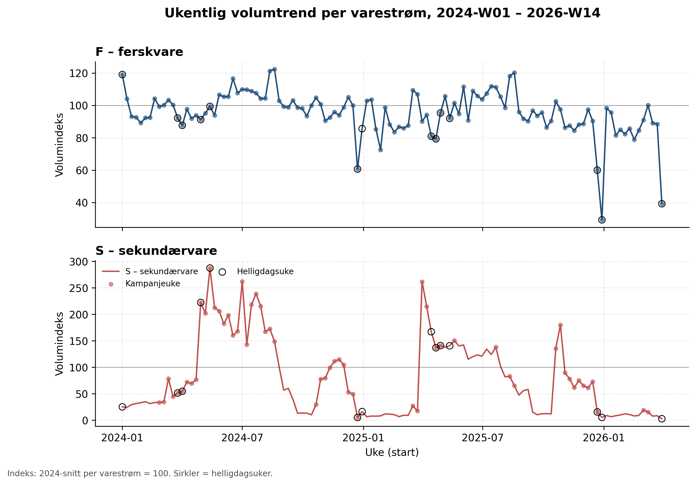
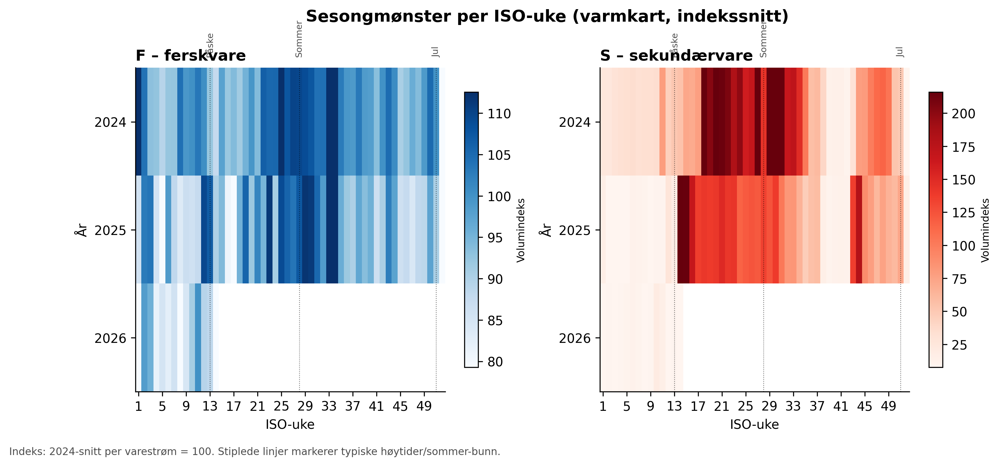
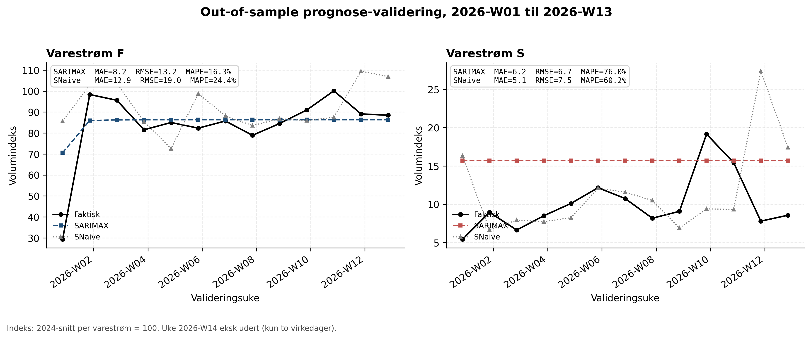
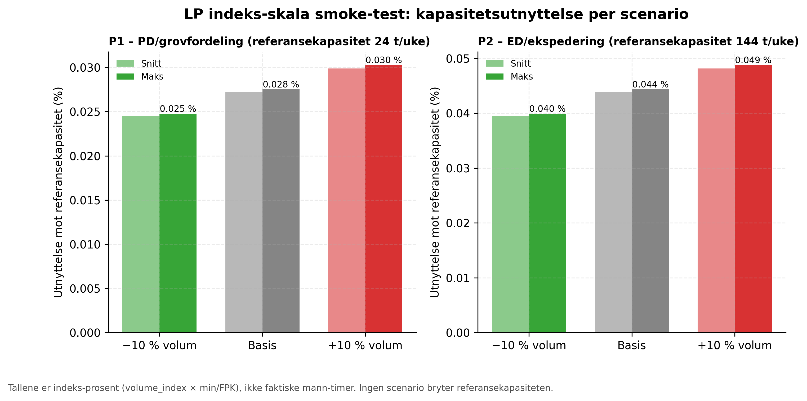
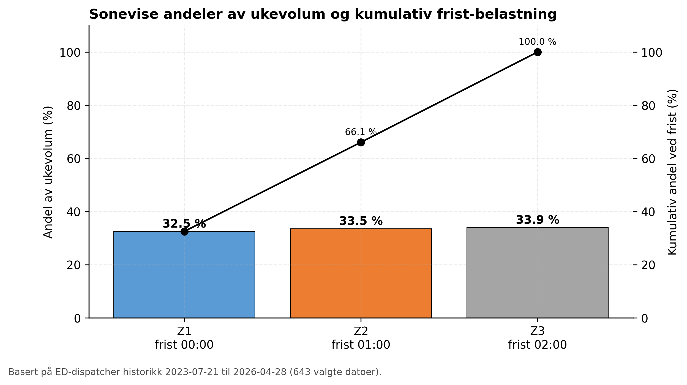
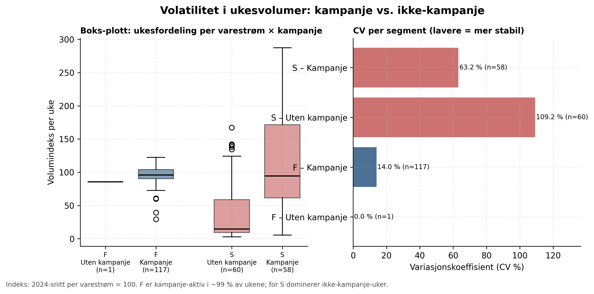

```{=latex}
\begin{titlepage}
\thispagestyle{empty}
\noindent
\includegraphics[width=0.42\textwidth]{figures/forside_mountain.png}

\vspace{1.0cm}

{\fontsize{38}{42}\selectfont\bfseries Prosjektoppgave}\par
\vspace{1.0cm}

{\Large\bfseries LOG650 Forskningsprosjekt: Logistikk og kunstig intelligens}\par
\vspace{0.9cm}

{\LARGE Integrert volumprognose og kapasitetsanalyse}\par
\vspace{0.25cm}
{\large\itshape Integrated Volume Forecasting and Capacity Analysis}\par
\vspace{1.0cm}

{\large Davor Necemer}\par
\vspace{0.8cm}

{\large Totalt antall sider inkludert forsiden: 36}\par
\vspace{0.5cm}
{\large Molde, 1. juni 2026}\par

\vfill
\hfill\includegraphics[width=0.32\textwidth]{figures/forside_him_logo.jpeg}
\end{titlepage}
```

## Obligatoriske erklæringer

### Obligatorisk egenerklæring/gruppeerklæring

Den enkelte student er selv ansvarlig for å sette seg inn i hva som er lovlige hjelpemidler, retningslinjer for bruk av disse og regler om kildebruk. Erklæringen skal bevisstgjøre studenten på eget ansvar og hvilke konsekvenser fusk kan medføre. Jeg bekrefter herved punktene 1–6 (alle avkrysset «ja»):

1. Jeg erklærer at min besvarelse er mitt eget arbeid, og at jeg ikke har brukt andre kilder eller mottatt annen hjelp enn det som er nevnt i besvarelsen. **(Ja)**
2. Jeg erklærer videre at besvarelsen ikke har vært brukt til annen eksamen ved annen avdeling/institusjon innenlands eller utenlands; ikke refererer til andres eller eget tidligere arbeid uten at det er oppgitt; har alle referansene oppgitt i litteraturlisten; og ikke er en kopi, et duplikat eller en avskrift av andres arbeid. **(Ja)**
3. Jeg er kjent med at brudd på ovennevnte er å betrakte som fusk og kan medføre annullering av eksamen og utestengelse fra universiteter og høgskoler i Norge, jf. universitets- og høyskoleloven §§ 4-7 og 4-8 og forskrift om eksamen §§ 14 og 15. **(Ja)**
4. Jeg er kjent med at alle innleverte oppgaver kan bli plagiatkontrollert. **(Ja)**
5. Jeg er kjent med at høgskolen vil behandle alle saker der det foreligger mistanke om fusk etter høgskolens retningslinjer. **(Ja)**
6. Jeg har satt meg inn i regler og retningslinjer for bruk av kilder og referanser. **(Ja)**

### Personvern

**Personopplysningsloven – vurdert av NSD (Sikt)?** Nei. Etter avklaring med veileder er vurderingen at innlevert og publisert materiale ikke krever NSD/Sikt-melding. Rapporten publiserer kun anonymiserte og aggregerte data, og analysegrunnlaget som inngår i rapporten inneholder ingen personopplysninger. Eventuelle lokale arbeidsregistreringer med personidentifiserende informasjon er ikke inkludert i modellfilene, rapporten eller andre publiserbare prosjektfiler.

**Helseforskningsloven – behandlet hos REK?** Nei. Prosjektet er ikke medisinsk eller helsefaglig forskning og faller ikke inn under helseforskningsloven.

### Publiseringsavtale

**Studiepoeng:** 15

**Veileder:** Per Kristian Rekdal og Bård-Inge Pettersen

Jeg gir herved Høgskolen i Molde en vederlagsfri rett til å gjøre oppgaven tilgjengelig for elektronisk publisering i Brage HiM: **Nei.** Bedriftens/arbeidsgivers samtykke til publisering er ikke innhentet, og datagrunnlaget er hentet via studentens yrkesrolle; oppgaven leveres til vurdering uten å samtykke til åpen publisering.

Er oppgaven båndlagt (konfidensiell)? **Nei.** Det foreligger ingen signert båndleggings-/taushetsavtale. Rapporten bygger på anonymiserte indeksdata og aggregerte prosess-tidsrater; reelle volum, kunde-/produktdetaljer og kostnader inngår ikke.

**Dato:** 1. juni 2026

\clearpage

### Bruk av KI-verktøy

Denne besvarelsen er utarbeidet med kunstig intelligens (Claude / Claude Code fra Anthropic og Codex fra OpenAI) som verktøy under min styring og kontroll, i tråd med Høgskolen i Molde sine retningslinjer for bruk av KI på hjemmeeksamen og det innsendte KI-egenerklæringsskjemaet. I samsvar med egenerklæringen punkt 1 («det som er nevnt i besvarelsen») beskrives bruken her. KI-verktøy er benyttet til følgende formål:

- **Tekst og skrivehjelp:** utkast og omformulering av kapitteltekst, som jeg deretter har bearbeidet, kontrollert og godkjent.
- **Språkvask og korrekturlesing:** retting av språk, struktur og konsistens.
- **Programmering og kodehjelp:** Python-skript for datavask, anonymisering, SARIMAX/SNaive-modellering, LP-løser og automatisk PDF-bygging.
- **Analyse av digitale data:** databehandling og kjøring av prognose- og kapasitetsmodellene som ligger til grunn for resultatene.
- **Bilder og figurer:** generering av rapportens figurer (volumtrend, prognose-validering, soneprofil m.fl.) via kode.

Alle faglige valg, tolkninger og konklusjoner er mine egne. Jeg har lest, forstått og kvalitetssikret hele besvarelsen, kan stå inne for og forsvare innholdet, og bekrefter at all bruk av KI-verktøy er beskrevet her. Alle referanser er verifisert som reelle og etterprøvbare kilder: lenker og DOI er kontrollert, og kildene er lastet ned der forlagstilgang tillot det.

\newpage

## Sammendrag

Næringsmiddelbedrifter med to konvergerende varestrømmer mot ett felles distribusjonsledd opplever regelmessige flaskehalser når begge strømmer topper samme uke, selv når den aggregerte ukekapasiteten i utgangspunktet virker tilstrekkelig. Sonevise nattlige cut-off-frister (00:00, 01:00, 02:00) gjør at problemet ikke kan leses ut av et rent ukeaggregat. Denne rapporten utvikler og dokumenterer et integrert rammeverk som kobler etterspørselsprognose og kapasitetsoptimering på ukentlig nivå for en anonymisert norsk produksjons- og distribusjonsoperasjon med ferskvare (F) og sekundærvare (S).

Metoden er todelt og sekvensiell. En SARIMAX-modell prognostiserer ukentlig volum per varestrøm med kampanje- og helligdagskalender som eksogene kandidater, mens en Seasonal Naive (SNaive) baseline brukes som faglig sammenligningsstandard og operativ fallback dersom SARIMAX ikke gir bedre validering. Prognosene oversettes til arbeidsbelastning gjennom en empirisk prosess-tidsmatrise, og en lineær programmeringsmodell minimerer samlet ekstra kapasitet (overtid og tidlig oppstart) i prosessene `P1` (PD/for-klargjøring) og `P2` (ED/endelig dispatch) under en høy straffvekt for udekket arbeidsbelastning. Sonevise frister er aggregert som kumulative ukentlige andeler; i den løste smoke-testen er disse beregnet og rapportert, men ikke håndhevet som bindende fristbegrensninger i LP-løseren (se §6.5).

Empirisk grunnlag dekker 118 ukentlige observasjoner per varestrøm (2024-01 til 2026-14) i den publiserbare indeks-fila; av disse brukes 117 som modelluker etter at delvis uke 2026-14 ekskluderes, totalt 234 modellobservasjoner. Volum publiseres som indeks der 2024-gjennomsnitt per varestrøm er satt lik 100. Prosess-tider er estimert fra åtte komplette produksjons-/dispatcher-par til `P1` = 0.003885 og `P2` = 0.037555 minutter per FPK-ekvivalent. Soneprofilen er beregnet fra 643 dispatcher-datoer med eksakte andeler 0.325311, 0.335234 og 0.339455 (sum 1.000000; avrundede verdier Z1 = 0.325, Z2 = 0.335, Z3 = 0.339 summerer til 0.999 grunnet avrunding). Basekapasitet er 24 mann-timer/uke for `P1` og 144 mann-timer/uke for `P2`. SNaive-validering på 2026-01 til 2026-13 gir MAE/RMSE 12.88/18.96 for F og 5.15/7.53 for S målt på indeks-skala. Den gjennomførte SARIMAX-gridkjøringen forbedrer RMSE fra SNaive 18.96 til 13.21 for F (valgt modell med helligdagsflagg som eneste eksogene variabel) og fra 7.53 til 6.67 for S (uten eksogen variabel). S-modellen vinner imidlertid kun på RMSE og er svakere enn SNaive på både MAE og MAPE; den kan derfor ikke regnes som en reell forbedring og tolkes varsomt.

Rapporten leverer nå en teknisk minimumsimplementasjon av det integrerte rammeverket: datagrunnlag, prosess-tidsmatrise, kapasitetsbaseline, soneprofil, SARIMAX-validering og LP-løser er koblet i ett reproduserbart skript. LP-kjøringen er en publiserbar indeks-skala smoke-test, ikke et operativt estimat på reelle mann-timer; den gir 0.00 ekstra indeks-timer og 0.00 slack i valideringshorisonten fordi anonymisert indeks ikke inneholder reelle FPK-skalaer. Gjenstående arbeid er derfor reell-skala LP med lokal `weekly_volume.csv`, kalibrering av sonevise fristkapasiteter og full sensitivitetsanalyse.

**Nøkkelord:** SARIMAX, lineær programmering, kapasitetsplanlegging, distribusjonsfrister, etterspørselsprognose, næringsmiddellogistikk, anonymisering.

## Abstract

Food production and distribution operations with two parallel product streams converging on a shared dispatch process face a recurring bottleneck when both streams peak in the same week, even when aggregate weekly capacity appears sufficient. Zone-based nightly cut-off deadlines (00:00, 01:00, 02:00) mean the problem cannot be detected from weekly totals alone. This report develops and documents an integrated weekly-level framework that links demand forecasting and capacity optimization for an anonymized Norwegian food production and distribution operation with a fresh stream (F) and a secondary stream (S).

The approach is sequential and consists of two components. A SARIMAX model forecasts weekly volume per stream using promotion and holiday calendars as exogenous candidates (the selected F model uses a holiday flag; the selected S model uses none), with a Seasonal Naive (SNaive) model serving as both a methodological benchmark and an operational fallback when SARIMAX fails to outperform it on validation. Forecasts are translated into workload through an empirically derived process-time matrix, and a linear programming model minimises total additional capacity (overtime and early start) in processes `P1` (PD / pre-dispatch preparation) and `P2` (ED / final dispatch) under a high penalty weight for uncovered workload. Zone-level deadlines are aggregated as cumulative weekly shares; in the solved smoke test these are computed and reported but not enforced as binding constraints in the LP solver (see §6.5).

The empirical basis covers 117 modelling weeks (2024-01 to 2026-13, week 2026-14 excluded as a partial week), two product streams and 234 observations in total. Volumes are published as an index normalised so the 2024 mean per stream equals 100. Process times are estimated from eight complete production/dispatcher pairs as `P1` = 0.003885 and `P2` = 0.037555 minutes per FPK-equivalent. The zone profile is derived from 643 dispatcher dates (Z1 = 0.325, Z2 = 0.335, Z3 = 0.339; exact shares sum to 1.000000, while these rounded values sum to 0.999). Base capacity is 24 worker-hours/week for `P1` and 144 worker-hours/week for `P2`. SNaive validation across 2026-01 to 2026-13 yields MAE/RMSE 12.88/18.96 for F and 5.15/7.53 for S on the index scale. The SARIMAX grid run improves RMSE from SNaive 18.96 to 13.21 for F and from 7.53 to 6.67 for S; the S result wins only on RMSE and is weaker than SNaive on both MAE and MAPE, so it cannot be regarded as a genuine improvement and is interpreted cautiously.

The report now delivers a technical minimum implementation of the integrated framework: data foundation, process-time matrix, capacity baseline, zone profile, SARIMAX validation and LP solving are connected in one reproducible script. The LP run is a publishable index-scale smoke test, not an operational estimate of real worker-hours; it produces 0.00 extra index-hours and 0.00 slack across the validation horizon because the anonymised index file does not contain real FPK scales. Remaining work is therefore real-scale LP using local `weekly_volume.csv`, calibration of zone-level deadline capacities and full sensitivity analysis.

**Keywords:** SARIMAX, linear programming, capacity planning, distribution deadlines, demand forecasting, food logistics, anonymization.

## Innhold

- Forkortelser og symboler
- 1.0 Innledning
  - 1.1 Problemstilling
  - 1.2 Delproblemer
  - 1.3 Avgrensinger
  - 1.4 Antagelser
- 2.0 Litteratur
  - 2.1 Etterspørselsprognose med tidsseriemodeller
  - 2.2 Kapasitetsplanlegging gjennom linear programming
  - 2.3 Flaskehals-dynamikk i konvergerende logistikk
- 3.0 Teori
  - 3.1 Tidsserieanalyse og prognoser
  - 3.2 Linear Programming og optimering
  - 3.3 Modellintegrasjon i prosjektet
- 4.0 Casebeskrivelse
  - 4.1 Bedrift og bransje
  - 4.2 Operasjonell struktur
  - 4.3 Flaskehals-problematikk
  - 4.4 Tilgjengelige data
  - 4.5 Bedriftens utfordring og motivasjon
- 5.0 Metode og data
  - 5.1 Metode (5.1.1 SARIMAX, 5.1.2 Linear Programming)
  - 5.2 Data
  - 5.3 Databehandling og anonymisering
  - 5.4 Datakvalitet og kontroll
  - 5.5 Forskningsetikk og konfidensialitet
- 6.0 Modellering
  - 6.1 Modellstruktur
  - 6.2 Notasjon og beslutningsvariabler
  - 6.3 Målfunksjon
  - 6.4 Hovedbegrensninger
  - 6.5 Sonevise fristbegrensninger
  - 6.6 Tiltakstyper og videre detaljering
  - 6.7 Ikke-negativitet og variabelbegrensninger
  - 6.8 Løsningsmetode
- 7.0 Analyse
  - 7.1 Data-deskriptiv analyse
  - 7.2 Valgt prognosestrategi og modellvalg
  - 7.3 Kapasitetsmodell-setup
- 8.0 Resultater
  - 8.1 Datavalidering og aggregering
  - 8.2 Prosess-tidsmatrise etablert
  - 8.3 Kapasitets-baseline etablert
  - 8.4 Prognosevalidering og LP smoke-test
  - 8.5 Kritiske funn og gjenstående arbeid
- 9.0 Diskusjon
  - 9.1 Metodisk vurdering
  - 9.2 Datagrunnlag og etterprøvbarhet
  - 9.3 Operativ relevans og næringslivets perspektiv
  - 9.4 Bidrag, kritikk og videre forskning
- 10.0 Konklusjon
- 11.0 Bibliografi
- 12.0 Vedlegg

## Forkortelser og symboler

Sentrale forkortelser forklares også ved første naturlige bruk i teksten; denne listen samler dem for oppslag.

| Forkortelse | Betydning |
|---|---|
| F | Ferskvare – den ferske varestrømmen |
| S | Sekundærvare – den sekundære (lengre holdbarhet) varestrømmen |
| FPK | Forbrukerpakning. *FPK-ekvivalent* brukes som operasjonell håndteringsenhet i distribusjonsleddet (én fysisk plukk-/sorteringsenhet) |
| DPK | Distribusjonspakning – salgsenhet som kan håndteres som én FPK-ekvivalent |
| P1 | Prosess 1 i modellen: PD / for-klargjøring |
| P2 | Prosess 2 i modellen: ED / endelig dispatch |
| PD | Pre-dispatch – forberedende klargjøring/sortering før ekspedering (datalabel for P1) |
| ED | Endelig dispatch / ekspedering mot distribusjonsfristene (datalabel for P2) |
| DD | Direkte/særskilt dispatchflyt; holdes utenfor hovedmodellen pga. lavt volum |
| LP | Linear Programming (lineær programmering) |
| APP | Aggregate Production Planning |
| SARIMAX | Seasonal AutoRegressive Integrated Moving Average with eXogenous variables |
| SNaive | Seasonal Naive – sesongbasert baseline-/fallback-modell |
| MAE / RMSE / MAPE | Feilmål: gjennomsnittlig absoluttfeil / kvadratisk gjennomsnittsfeil / gjennomsnittlig absolutt prosentfeil |
| Z1, Z2, Z3 | Soner med nattlige cut-off-frister (00:00, 01:00, 02:00) |

## 1.0 Innledning

Effektiv distribusjon av matvarer er viktig både for bedrifter, kunder og samfunnet rundt dem. Varene har korte tidsvinduer, begrenset holdbarhet og leveringsfrister som ofte må oppfylles samme natt som volumet behandles. Når etterspørselen endrer seg raskt på grunn av sesong, kampanjer eller høytider, får dette direkte betydning for bemanning, overtid og leveringspresisjon.

I næringsmiddelbransjen blir denne utfordringen særlig tydelig når flere varestrømmer skal gjennom samme distribusjonsledd. Den totale ukekapasiteten kan se tilstrekkelig ut, samtidig som belastningen blir for høy på enkelte dager eller i bestemte nattlige fristvinduer. Resultatet kan bli fristbrudd, forsinkede leveranser eller behov for kostbar ekstrabemanning som kunne vært planlagt tidligere.

Denne rapporten tar utgangspunkt i en slik situasjon i en anonymisert norsk produksjons- og distribusjonsoperasjon. Formålet er å undersøke hvordan etterspørselsprognoser kan kobles til kapasitetsplanlegging, slik at belastningstopper blir synlige før de treffer driften. Rapporten utvikler derfor et integrert modellrammeverk og etablerer datagrunnlag for etterspørselsprognose og kapasitetsanalyse.

Litteraturen på etterspørselsprognose (demand forecasting) og aggregert produksjonsplanlegging (aggregate production planning) tilbyr vel etablerte løsninger for hver del av problemet. SARIMAX-modeller kan prognostisere etterspørsel under hensyn til sesongmønstre, planlagte kampanjer og andre eksogene faktorer, mens lineær programmering kan optimalisere kapasitetsallokering under stramme begrensninger. Ved å integrere disse to metodene kan prognosen brukes som input til en kapasitetsmodell, slik at planleggingen flyttes fra reaktiv håndtering til mer proaktiv ressursstyring.

Det faglige bidraget ligger ikke i å utvikle ny teori eller nye statistiske metoder, men i et case-spesifikt metodisk rammeverk som kobler sesongbasert tidsserieprognose (SARIMAX) og lineær programmering (LP) i én arbeidsflyt for en konkret natt-/terminalkontekst. Prognoselitteraturen vektlegger typisk prediksjonspresisjon, mens optimeringslitteraturen ofte forutsetter at etterspørselen er kjent. Rapporten viser hvordan prognosen kan levere input til en kapasitetsmodell, og hvor grensen går mellom en publiserbar indeks-skala smoke-test og et operativt reell-skala beslutningsgrunnlag. Dette bidraget utdypes i §9.4.

### 1.1 Problemstilling

**Hvordan kan etterspørselsprognoser og kapasitetsoptimering kombineres for å minimere ressursforbruk og synliggjøre kapasitetsrisiko mot sonevise distribusjons-cut-offs i en flerprosess næringsmiddelproduksjon?**

Denne problemstillingen er todelt:

Først undersøkes det hvordan en tidsserieprognose kan fange sesongvariasjoner og effekten av planlagte kampanjer. Deretter brukes prognosen som input til en kapasitetsmodell som beregner aggregert ekstra kapasitet og synliggjør udekket arbeidsbelastning. Den sonevise fristdimensjonen behandles som grunnlag for en senere operativ utvidelse, ikke som en ferdig daglig fristmodell i denne rapportversjonen.

Problemstillingen behandler altså hvordan man integrerer etterspørselsprognose og operasjonell planlegging for å løse en reell distribusjonsflaske-halssituasjon.

Det er samtidig viktig å presisere ambisjonsnivået: rapporten leverer et teknisk rammeverk med en gjennomført smoke-test på publiserbar indeks-skala, ikke en ferdig operativ kapasitetsanalyse. Prognosedelen er validert på reelle, men indekserte, volumdata, mens optimeringsdelen demonstrerer at løseren kjører korrekt og gir konsistente resultater på indeks-skala. Et operativt beslutningsgrunnlag uttrykt i kolli og mann-timer krever reelle volum og kalibrerte sonefrister, og avgrenses derfor til videre arbeid (se §9.4 og §10). Dette er en bevisst avgrensning fra den opprinnelige proposalens mål om å beregne nøyaktig operativ ekstra kapasitet per uke: her leveres det integrerte rammeverket og en indeks-skala smoke-test, mens reell-skala kapasitetsberegning står som videre arbeid.

### 1.2 Delproblemer

Problemstillingen løses gjennom to delproblem i rekkefølge:

Det første delproblemet gjelder etterspørselsprognosen: Hvordan kan SARIMAX-modeller estimeres og valideres ved bruk av historiske volumdata, sesongmønstre og kampanjekalender for å prognostisere ukentlig etterspørsel?

Det andre delproblemet gjelder kapasitetsoptimeringen: Gitt en etterspørselsprognose, hvordan kan lineær programmering formuleres og løses for å bestemme aggregert kapasitetsallokering som minimerer ressursforbruk og synliggjør udekket arbeidsbelastning, med sonevise cut-off-frister som grunnlag for en senere operativ utvidelse?

Disse delproblemene er sekvensielle: prognosen fra DP1 blir input til LP-modellen i DP2.

### 1.3 Avgrensinger

Studiet avgrenses først av aggregeringsnivået. Selv om problemet oppstår daglig gjennom sonevise frister kl. 00:00, 01:00 og 02:00, modelleres det her på ukentlig nivå. Dette er en bevisst praktisk forenkling med en kjent kostnad, ikke en antakelse om at dagsvariasjonen er uvesentlig. De sonevise fristene omregnes til kumulative ukentlige andeler som beskriver belastningsprofilen, men de håndheves ikke som egne bindende LP-begrensninger i smoke-testen. Siden sonene operasjonelt bruker samme ressursbemanning og skiftlengde, er forskjellen primært avgangstidspunkt, ikke kapasitetskarakteristikk.

Denne aggregeringen gjør det mulig å bruke tilgjengelige tidsseriedata for de to varestrømmene og forenkler LP-formuleringen betydelig. Kostnaden er at modellen ikke kan skille mellom en uke der totalvolumet er innenfor kapasitet, og en uke der enkeltdøgn eller enkeltsoner likevel bryter fristen. Modellen viser dermed når på året belastningen topper seg, men ikke hvilken natt eller sone som først får kapasitetsbrudd. Dagsvis og sonevis modellering ligger derfor utenfor dette prosjektets omfang, men er kritisk for faktisk operativ bruk og pekes ut som den sentrale videreutviklingen i §9.4.

Analysen avgrenses videre til distribusjonsklargjøringen etter at volumet er klart for utsendelse. Prosessene modelleres som P1, som dekker PD/for-klargjøring, og P2, som dekker ED/endelig dispatch eller ekspedering. DD behandles som direkte eller særskilt dispatchflyt som inngår i tidsgrunnlaget ved behov, men ikke som separat hovedprosess. Produksjonslister og dispatcher actions for lager 310 viser at tilgjengelig tidsdata måler håndtering mot distribusjonsfrister, ikke primær eller sekundær produksjonspakking. Prosessavgrensningen følger derfor det observerbare datagrunnlaget for å unngå at modellen estimerer kapasitet for prosesser som ikke er målt.

Rapportens publiserbare data og resultater er anonymisert eller aggregert, og bedriften identifiseres ikke. Sensitive rådata behandles lokalt og publiseres ikke, slik at både personvern og forretningshemmeligheter ivaretas. Av samme grunn optimaliserer modellen kapasitetsforbruk i ekstra mann-timer og udekket arbeidsbelastning (`SLACK`) målt i minutter, ikke faktiske norske kroner. Kostnadsdata er sensitive, mens ressursenhetsmål er mer generelle og etterprøvbare.

I distribusjonsleddet brukes FPK-ekvivalent som operasjonell håndteringsenhet. Dersom en DPK, kurv eller tilsvarende salgsenhet håndteres som én fysisk plukk- eller sorteringsenhet, teller den som én enhet i modellen selv om den inneholder flere underliggende forbrukerenheter. Dette skyldes at kapasitetsbelastningen i distribusjonsklargjøringen primært bestemmes av antall håndteringer, ikke av antall produkter inne i hver håndteringsenhet.

Til slutt er prosjektet avgrenset til teoretisk modellutvikling og teknisk minimumsimplementasjon. Operativ implementasjon av daglig mann-allokering ligger utenfor omfanget, slik at arbeidet kan konsentreres om prognostisering, modellformulering og dokumentasjon av hva som kreves før praktisk bruk.

### 1.4 Antagelser

Modellen bygger på fire sentrale antagelser. Den første er at sesongmønsteret i etterspørselen vil fortsette i prognosehorisonten. Dette er rimelig for stabil drift, men gjør modellen mindre pålitelig dersom markedsbetingelsene endres brått, for eksempel ved pandemi, ny konkurrent eller større sortimentsendringer.

Den andre antagelsen er at planlagte tilbud og kampanjer er kjent på planleggingstidspunktet. Dette passer med strategisk og taktisk planlegging, men fanger ikke uforutsette markedshendelser som oppstår etter at planen er lagt.

Den tredje antagelsen er at grunnkapasiteten per uke i hver prosess er kjent og stabil. Modellen håndterer derfor ikke stokastisk kapasitetsbortfall som sykdom, maskinbrudd eller uventet fravær. Robusthet er tenkt testet gjennom sensitivitets- og scenarioanalyse, men i denne publiserbare versjonen er bare en indeks-skala smoke-test med ±10 % volum gjennomført. Full sensitivitetsanalyse gjenstår (se §5.1.2 og §10).

Den fjerde antagelsen er at ekstra kapasitet, for eksempel overtid eller ekstrabemanning, kan skaleres lineært. Antagelsen gjør LP-modellen løsbar og oversiktlig, men praktisk implementering må verifisere om små kapasitetsøkninger faktisk kan gjennomføres uten betydelige oppstartskostnader eller andre ikke-lineære effekter.

## 2.0 Litteratur

Litteraturgrunnlaget for denne rapporten dekker tre sentrale fagfelt: (1) tidsserieprognose for sesongbunden etterspørsel, (2) operasjonell kapasitetsplanlegging under begrensninger, og (3) håndtering av flaskehalseffekter i distribusjonslogistikk. Disse feltene er vel etablert i akademisk litteratur og praktisk implementering i næringsmiddelbransjen.

### 2.1 Etterspørselsprognose med tidsseriemodeller

Etterspørselsprognoser er kritisk for produksjonsplanlegging, spesielt når kapasiteten er begrenset og distribusjonsfrister må overholdes. **Tidsseriemodeller** er etablert praksis for volumdata: **SARIMAX-modeller** (Seasonal Autoregressive Integrated Moving Average with eXogenous variables) håndterer trend, sesongmønstre og eksogene effekter som er typiske for næringsmiddelproduksjon.

SARIMAX kombinerer to sentrale egenskaper. **For det første** håndterer **SARIMA**-komponenten sesongmønstre som repeterer seg gjennom året (påske, jul, sommerferie), noe som er kritisk for næringsmiddeletterspørsel. Hyndman & Athanasopoulos (2021, kapittel 9, særlig avsnitt 9.9 om sesonglige ARIMA-modeller) gir det kanoniske rammeverket for ARIMA og sesonglige varianter, inkludert valg av differensierings- og lagordener. **For det andre** gjør eksogene variabler (Hyndman & Athanasopoulos, 2021, kapittel 10) det mulig å inkludere kampanjekalender og andre eksterne faktorer. Dette er viktig fordi planlagte tilbud og kampanjer kan drive etterspørselstopper ut over det et rent sesongmønster kan forklare.

Arunraj, Ahrens & Fernandes (2016) demonstrerer denne tilnærmingen for ferskvare i detaljhandel, der kampanjer og helligdager brukes som eksogene variabler for å forbedre prognoser sammenlignet med rene sesongmodeller. Selv om deres case gjelder daglig butikkvolum mens denne rapporten fokuserer på ukentlig distribusjonsvolum, er metodologien relevant: sesongmønster og kampanjeeffekter påvirker etterspørsel i begge kontekster.

Fildes, Ma & Kolassa (2022) gjennomgår retail forecasting på tvers av ulike aggregeringsnivåer og diskuterer hvordan aggregering kompliserer planleggingen når kampanjer og sesongmønster påvirker etterspørselen ujevnt. I denne rapporten brukes samme logikk på distribusjonsleddet: overgangen fra sonevise daglige frister til ukentlig prognosering krever eksplisitt vurdering av sesongeffekter og kampanjer, slik at ukentlige prognoser ikke skjuler kritiske dags- eller sonevise belastningstopper.

### 2.2 Kapasitetsplanlegging gjennom linear programming

**Linear Programming (LP)** er en veletablert metodikk for allokering av begrenset kapasitet når målet er å minimere kostnad eller ressursforbruk under strenge begrensninger (Winston, 2004). **Aggregate Production Planning (APP)** løser nettopp dette problemet: på ukentlig eller månedlig nivå bestemmer modellen hvor mye ekstra kapasitet (overtid, ekstrabemanning, tidlig oppstart) som kreves for å møte prognostisert etterspørsel innenfor faste distribusjonsfrister.

Holt, Modigliani & Simon (1955) etablerte den lineære beslutningsregelen som fundamentet for moderne APP, der lineære regler for bemanning og produksjon kan minimere samlede kostnader under etterspørselsusikkerhet. I dagens praksis håndteres APP under både kapasitets- og etterspørselsbegrensninger. Leung, Wu & Lai (2006) formulerer APP for flere produksjonslokasjoner med stokastisk etterspørsel og arbeidskraftsbegrensninger; denne metodiske tilnærmingen er relevant for rapportens toprosessproblem i distribusjon, selv om konteksten er annerledes.

I dette prosjektet modelleres kapasitetsbehovet som et LP-minimeringsproblem. Målfunksjonen minimerer samlet ekstra kapasitet og gjør eventuell udekket arbeidsbelastning eksplisitt gjennom en straffet `SLACK`-variabel. Begrensningene sikrer at arbeidsbelastningen (prognostisert volum omregnet til minutter) ikke overstiger tilgjengelig kapasitet, definert som grunnbemanning og dokumentert mulig ekstra kapasitet. Sonevise frister kan i prinsippet modelleres som egne begrensninger, men holdes utenfor smoke-testen i denne rapportversjonen. Denne strukturen følger standard APP-praksis som beskrevet av Winston (2004) og Leung et al. (2006).

### 2.3 Flaskehals-dynamikk i konvergerende logistikk

Når flere varestrømmer konvergerer til felles distribusjonsledd, oppstår en kompleks kapasitetsutfordring: selv om total ukekapasitet er tilstrekkelig når man aggregerer, kan et dags- eller sonevis fristkrav bli brutt hvis volumtoppene ikke er tidssynkronisert. Dette er et kjent fenomen i distribusjonslogistikk hvor høy etterspørselsvariabilitet møter stramme operasjonelle frister.

Fildes et al. (2022) diskuterer hvordan aggregering og kompleksitet i etterspørsel påvirker prognosenøyaktighet. Lignende logikk gjelder her: når man aggregerer fra daglige sonevise frister til ukentlig prognosering, risikerer man at kritiske daglige belastningstopper maskeres i ukentlige aggregater. I denne rapporten omregnes de sonevise fristene (kl. 00:00, 01:00, 02:00) til kumulative ukentlige andeler som grunnlag for å beskrive sonebelastningen og forberede en senere sonevis fristmodell. Den løste LP-modellen i denne versjonen bruker aggregert kapasitet og håndhever ikke sonefristene som bindende begrensninger (se §6.5).

Rapportens bidrag er ikke en påstand om et generelt teoretisk hull, men et case-spesifikt rammeverk for å koble SARIMAX-prognoser og LP-basert kapasitetsanalyse i en konkret terminal-/nattfristkontekst. Prognoselitteraturen (Hyndman & Athanasopoulos, 2021; Arunraj et al., 2016; Fildes et al., 2022) vektlegger typisk prediksjonspresisjon, mens optimeringslitteraturen (Winston, 2004; Leung et al., 2006) ofte forutsetter at etterspørselen er kjent og deterministisk gitt. Rapporten viser hvordan en prognose kan brukes som input til en kapasitetsmodell, samtidig som den avgrenser hva som kan konkluderes fra en indeks-skala smoke-test uten reelle FPK-volum og kalibrerte sonefrister. Det metodiske bidraget diskuteres nærmere i §9.4.

## 3.0 Teori

### 3.1 Tidsserieanalyse og prognoser

En **tidsserie** er en sekvens av observasjoner ordnet kronologisk, typisk med jevn tidsavstand (f.eks. ukentlige volumer). Tidsserier har tre karakteristiske komponenter (Hyndman & Athanasopoulos, 2021, kapittel 9):

- **Trend:** langvarig retning (stigning, stagnasjon, eller fall)
- **Sesongmønstre:** repeterende mønstre på kort sikt (f.eks. ukentlige eller årlige rytmer)
- **Residualer:** tilfeldig variasjon som ikke forklares av trend eller sesong

**SARIMAX-modeller** (Seasonal ARIMA with eXogenous variables) er matematiske rammer som modellerer disse komponentene samt eksterne påvirkninger. En SARIMAX-modell estimeres ved å minimere forskjellen mellom observerte verdier og modellens prediksjoner (vanligvis målt som Mean Absolute Error eller Root Mean Square Error).

Modellen består av fire deler (Hyndman & Athanasopoulos, 2021, kapittel 9–10):

1. **ARIMA-kjernen** håndterer autoregressive (AR) og moving average (MA) strukturer som fanger kortsiktig avhengighet mellom observasjoner
2. **Sesongkomponenten** modellerer repeterende mønstre over året (f.eks. 52 uker i ukesdata) via sesonglag
3. **Integreringsleddet** håndterer både trend (differensiering $d$) og sesongavdrift (sesongdifferensiering $D$) for å oppnå stasjonaritet
4. **Eksogene variabler** (kampanjekalender, helligdager) fanges eksplisitt (kapittel 10) som separate regressorer

Kombinasjonen av disse gjør SARIMAX spesielt egnet for sesongbundne varetyper med kjente kampanjepåvirkninger. Parameterestimering foregår via maximum likelihood estimation (MLE), og modellvalg støttes av informasjonskriterier som AICc og stasjonaritetstester.

For automatisk modellvalg brukes stepwise-algoritmer som `auto_arima` (Hyndman & Khandakar, 2008). Algoritmen tester kandidatmodeller systematisk, prioriterer parsimoniske ordener på små datasett, og rangerer modeller etter informasjonskriterier samtidig som residualene kontrolleres mot hvit støy (for eksempel med Ljung-Box-test).

### 3.2 Linear Programming og optimering

**Linear Programming** er en matematisk optimeringsmetode for å finne beste beslutning under lineære begrensninger (Winston, 2004). Generell form:

$$
\begin{aligned}
\text{Minimiser:} \quad & c_1 x_1 + c_2 x_2 + \dots + c_n x_n \quad &(\text{Målfunksjon}) \\
\text{Under:} \quad & A x \leq b \quad &(\text{Lineære begrensninger}) \\
& x \geq 0 \quad &(\text{Ikke-negativitet})
\end{aligned}
$$

hvor $c$ er en kostnads- eller vektvektor, $x$ er beslutningsvariablene, $A$ er en matrise av koeffisienter, og $b$ er høyre-side-verdier.

I **Aggregate Production Planning (APP)** bestemmer LP-modellen optimal allokering av kapasitet (overtid, ekstrabemanning, tidlig oppstart) gitt:

- **Prognostisert etterspørsel** (fra SARIMAX)
- **Grunnkapasitet per uke per prosessledd** (fra historiske data eller kapasitetsforutsetninger)
- **Sonevise distribusjonsfrister** som må vurderes i operativ planlegging
- **Mål:** minimere total ekstra kapasitet (overtid, bemanning)

LP-modellen kan løses eksakt ved bruk av **Simplex-algoritmen** eller **interiørpunktmetoder** (Winston, 2004). Løsningen er en optimal allokeringsplan for de to hovedprosessene i distribusjonsklargjøringen som oppfyller alle begrensninger samtidig som målfunksjonen minimeres.

For APP-kontekster med usikker etterspørsel og flere lokasjoner henviser Leung, Wu & Lai (2006) til stokastisk programmering som en robust utvidelse av deterministisk LP. I denne rapporten brukes deterministisk LP (med SARIMAX punkt-prognoser) som fundament. Usikkerheten er *tenkt* håndtert gjennom scenarioanalyse; i denne versjonen er kun en indeks-skala ±10 %-smoke-test kjørt (§8.4), mens full sensitivitetsanalyse gjenstår (§9.4, §10).

### 3.3 Modellintegrasjon i prosjektet

Dette prosjektet integrerer begge tilnærminger sekvensielt:

1. **Fase 1 – Etterspørselsprognose:** SARIMAX-modellen estimeres basert på historiske ukentlige volumdata, sesongmønstre og kampanjekalender, separat for ferskvare og sekundærvare. Resultat: prognose per uke og varestrøm.
2. **Fase 2 – Kapasitetsoptimering:** LP-modellen bruker denne prognosen som fast input og beregner behov for aggregert ekstra kapasitet, med sonevise frister som dokumentert belastningsprofil og videre operativ utvidelse.

Denne todelte strukturen gjør det mulig å vurdere konsekvensene av prognoseusikkerhet i kapasitetsmodellen, blant annet gjennom straffvekt for udekket arbeidsbelastning og scenarioanalyse. Modellen er dermed *tenkt* testet under plausible volumavvik før operativ bruk; i denne versjonen er kun en indeks-skala ±10 %-smoke-test gjennomført (§5.1.2, §8.4), og reell sensitivitetstesting gjenstår (§10).

## 4.0 Casebeskrivelse

### 4.1 Bedrift og bransje

Caset baseres på en anonymisert norsk bedrift innen næringsmiddelproduksjon og distribusjon. Bedriften har to parallelle produksjonsfilialer som sender volum inn til et sentralisert distribusjonsledd:

- **Filial A (Ferskvare):** Kortlevetids friske matvarer med streng holdbarhet (1–7 dager)
- **Filial B (Sekundær/handelsvare):** Lengre-levetids pakket og lagret vare (uker til måneder)

Begge varestrømmer må gjennomgå samme distribusjonsledd før utsendelse til kunder. Dette er den kritiske flaskehalsen i systemet.

### 4.2 Operasjonell struktur

Distribusjonsoperasjonen modelleres som to hovedledd i dispatcherflyten:

1. **P1 - PD / for-klargjøring:** Forberedende klargjøring, sortering eller pre-dispatch før endelig ekspedering.
2. **P2 - ED / endelig dispatch/ekspedering:** Ferdigstilling av volumet mot distribusjonsfristene.

I datagrunnlaget finnes også `DD`, som tolkes som direkte eller særskilt dispatchflyt. Denne flyten holdes foreløpig utenfor hovedprosessene fordi observasjonene viser lavt volum og svært lav registrert tid sammenlignet med `PD` og `ED`. Dersom flere uker viser at `DD` er operativt vesentlig, kan den senere skilles ut som en egen prosess eller behandles som egen scenarioforutsetning.

Hver prosess har en grunnkapasitet (standard ukekapasitet, *Standard Working Hours*). Kapasiteten er ikke fullt ut fleksibel, men kan utvides gjennom:
- Overtid
- Ekstra skift (bemanning)
- Tidlig oppstart av for-klargjøring eller ekspedering i dispatcherleddet

### 4.3 Flaskehals-problematikk

Selv om den totale ukekapasiteten er tilstrekkelig når man aggregerer, oppstår regelmessige kapasitetsbrudd på grunn av **sonevise distribusjonsfrister**:

- Volumet fordeles over soner med nattlige cut-off-frister kl. 00:00, 01:00 og 02:00
- Begge varestrømmer bruker samme distribusjonsledd før utsendelse
- Hvis både ferskvare og sekundærvare topper samme dag, kan distribusjonsklargjøring bli presset selv om ukekapasiteten virker tilstrekkelig

**Eksempel:** En tirsdag må 80 % av ukens volum ferdigstilles, mens resten av uken har lavere belastning. Selv om total ukekapasitet er tilstrekkelig, blir tirsdag en kritisk belastningsdag som krever betydelig ekstra kapasitet.

Problemet forverres av sesongmønstre (høysesonger med kampanjer) som driver etterspørselen opp på spesifikke uker.

### 4.4 Tilgjengelige data

Bedriften har tilgang til:

- **Historisk volumdata:** Ukentlige volumer (FPK-ekvivalenter) for begge varestrømmer over minimum 2 år
- **Kampanjekalender:** Planlagte tilbud og markedsføringskampanjer som er kjent i forkant
- **Grunnkapasitet:** Dokumentert standard ukekapasitet (*Standard Working Hours*) for hver av de to hovedprosessene
- **Soneprofil:** Sonevise cut-off-tider og aggregerte ukentlige andeler for fristbelastning
- **Kostnadsinformasjon:** Indikative kostnader for overtid, ekstrabemanning, og tidlig oppstart (kan være sensitiv)

### 4.5 Bedriftens utfordring og motivasjon

Bedriften søker en prognose- og optimeringsmodell som kan:

1. **Predikere etterspørsel** akkurat der volumene lander hver uke (under hensyn til sesong og kampanjer)
2. **Planlegge kapasitet** på ukebasis for de to hovedprosessene
3. **Minimere ressursforbruk** (overtid og ekstrabemanning) ved å identifisere kritiske ukentlige belastningstopper tidlig

Med en slik modell kan ledelsen ta proaktive beslutninger i stedet for å reagere etter at kapasitetsbrudd allerede har oppstått. Dette er både kostnads- og kvalitetsmessig viktig for bedriften.

## 5.0 Metode og data

### 5.1 Metode

Metodedelen er todelt: §5.1.1 beskriver etterspørselsprognosen (SARIMAX med SNaive-baseline), og §5.1.2 beskriver kapasitetsoptimeringen (lineær programmering).

### 5.1.1 Metode – Etterspørselsprognose (SARIMAX)

**Paradigme:** Kvantitativ case-studie basert på historiske operasjonelle data fra en produksjon- og distribusjonsoperasjon.

**Datavindu og modellstrategi:** Datagrunnlaget for prognosedelen består av ukentlige observasjoner for perioden 1. januar 2024 til 31. desember 2025, totalt 104 observasjoner per varestrøm. Modellen trenes på denne perioden og valideres deretter out-of-sample mot observerte ukedata for perioden 1. januar 2026 til 29. mars 2026. Dette følger prinsippet om hold-out-validering for tidsseriemodeller, der testdata ikke brukes i estimeringen (Hyndman & Athanasopoulos, 2021). På ukesnivå representeres treningsperioden som uke 2024-01 til 2025-52 (104 uker), og valideringsperioden som uke 2026-01 til 2026-13 (13 uker).

Uke 2026-14 ekskluderes fra validering fordi den inneholder kun 2 arbeidsdager (30.–31. mars), noe som gir anomalt lavt volum (F: 39.26, S: 2.83 indeks-enheter) som ikke representerer normal ukesdynamikk. Å inkludere slike anomalier i valideringsmetrikker kan gi skjeve MAE/RMSE-estimater.

Endelig modellspesifikasjon fastsettes etter datakontroll og innledende eksplorativ analyse, slik at modellens kompleksitet tilpasses datamaterialets kvalitet, lengde og tilgjengelige eksogene variabler. I denne minimumsimplementasjonen estimeres hver kandidat på treningsdata (2024–2025), og det er den valgte modellens out-of-sample valideringsprognose (2026-01 til 2026-13) som mates inn i kapasitetsmodellens smoke-test. Re-estimering på hele datasettet og en egen fremtidsprognose ut over valideringshorisonten hører til reell-skala-arbeidet (§9.4).

**Prognosemodell:** SARIMAX (Seasonal Autoregressive Integrated Moving Average with eXogenous variables) velges fordi (se også seksjon 2.1):
- Tidsseriene (ukentlige volumer) har **tydelige sesongmønstre** (høysesonger knyttet til julekampanjer, påske, sommerferie) og underliggende trend
- Eksogene variabler (kampanjekalender) påvirker etterspørselen betydelig utover det sesongbaserte nivået
- Næringsmiddeletterspørsel følger årlige sesongmønstre som SARIMAX håndterer godt (Arunraj, Ahrens & Fernandes, 2016)
- SARIMAX er etablert praksis i etterspørselsprognose for sesongbundne varer (Hyndman & Athanasopoulos, 2021)

**Modellspesifikasjon:**

Modellen estimeres separat for ferskvare (F) og sekundærvare (S):

$$\Phi(B) \Phi_s(B^s) \nabla^d \nabla_s^D Y_t = \Theta(B) \Theta_s(B^s) \epsilon_t + \beta X_t$$

hvor:
- $Y_t$ = ukentlig volum (FPK-ekvivalenter)
- $B$ = backshift-operator
- $s$ = sesongperiode (52 uker for årlig sesong i ukesdata)
- $\nabla^d$ = d-te orden differensiering (for trend-stationaritet)
- $\nabla_s^D$ = sesongdifferensiering av orden D (for sesong-stationaritet)
- $\Phi(B)$ = autoregressive polynom av orden p
- $\Phi_s(B^s)$ = sesongavhengig autoregressive polynom av orden P
- $\Theta(B)$ = moving average polynom av orden q
- $\Theta_s(B^s)$ = sesongavhengig moving average polynom av orden Q
- $\epsilon_t$ = hvit støy
- $X_t$ = eksogen vektor (kampanjeindikator, helligdag-dummy, osv.)
- $\beta$ = koeffisientvektor for eksogene variabler

Her viser F og S til varestrømmene ferskvare og sekundærvare, mens $s$ i SARIMAX-formelen viser sesonglengden og ikke varestrømmen sekundærvare. For ukedata settes $s = 52$ fordi etterspørselen forventes å følge et årlig sesongmønster.

**Parameterestimering (med datakvalitetshensyn):**

Gitt at treningsdata omfatter bare 104 observasjoner (2 sesongperioder), legges det opp til en konservativ strategi. Korte datasett risikerer overparametrisering hvis man estimerer høye lagordener, særlig for sesongkomponenten. Strategien består av:

1. **Baseline-modell:** Seasonal Naive (SNaive)
   - Prognose: $\hat{y}_{t} = y_{t-52}$ (observasjon fra 52 uker siden)
   - **Rolle:** Enkel sammenligningsstandard. Hyndman & Athanasopoulos (2021) viser at enkle metoder bør brukes som benchmark for mer komplekse prognosemodeller. Arunraj, Ahrens & Fernandes (2016) viser at SARIMAX med kampanjevariabler kan forbedre prognosering i matvarehandel. Hvis SARIMAX ikke slår SNaive på validering, brukes SNaive som operativ prognose.

2. **SARIMAX-kandidater via konservativ `statsmodels`-grid:**
   - En fast, avgrenset kandidatgrid over lave ikke-sesongordener $(p, d, q)$ og parsimoniske sesongordener $(P, D, Q)_{52}$ enumereres systematisk. Differensieringsordenene $d$ og $D$ inngår som griddimensjoner og holdes lave ($d, D \in \{0, 1\}$) i stedet for å velges via egne stasjonaritetstester
   - Formelle tester (KPSS for trend, Canova-Hansen for sesong) og ACF/PACF-inspeksjon kunne brukes til å forhåndsavgrense ordenene, men er **ikke** kjørt i denne minimumsimplementasjonen; det parsimoniske gridsøket erstatter dem
   - Hver kandidat estimeres med MLE, og kandidater som ikke konvergerer forkastes

3. **Modellvalg:**
   - Kandidater som krever $P > 1$ eller $D > 1$ forkastes (lite data til robust estimering på sesongkomponenten)
   - Valg baseres primært på **out-of-sample validerings-RMSE** (jf. den utdypende begrunnelsen i §7.2), med AICc (Akaike Information Criterion corrected for small samples; Hyndman & Khandakar, 2008) og parsimoni (antall parametre) som sekundære kriterier
   - **Ljung-Box test** brukes for å sikre at residualene mangler autokorrelasjon (hvit støy)
   - Endelig modell estimeres via **Maximum Likelihood Estimation (MLE)**

4. **Vurdering av eksogene variabler:**
   - `campaign_flag` er aktivert i 116 av 117 modelluker for F (99 %; 117/118 før eksklusjon av 2026-14)
   - Binær flagg har minimal variasjon → liten forklaringskraft
   - **Alternativ:** Fildes et al. (2022) diskuterer kompleksiteten i kampanjeinformasjon og eksogene variabler i retail forecasting. For dette prosjektet kan kampanjeintensitet (antall kampanjer per uke) eller kampanjetype gi mer informasjon enn et nær-konstant binært flagg.
   - For S ble både `campaign_flag` og `holiday_flag` testet som kandidater, men den valgte S-modellen bruker ingen eksogen variabel (jf. §7.2)

**Validering:** Modell valideres out-of-sample på uke 2026-01 til 2026-13 (13 uker, uke 2026-14 ekskludert):
- **Sammenligningskriterier:**
  - MAE (Mean Absolute Error)
  - RMSE (Root Mean Squared Error)
  - MAPE (Mean Absolute Percentage Error)
  - Alle målt mot SNaive baseline
- **Residualdiagnostikk:** Ljung-Box test for autokorrelasjon og sesongavhengighet
- **Beslutning:** Hvis SARIMAX RMSE > SNaive RMSE, brukes SNaive som operativ prognose

**Verktøy:** Python er hovedverktøyet i prognosedelen.
- `005 report/scripts/run_forecast_capacity_models.py` kjører en konservativ kandidatgrid med `statsmodels.tsa.statespace.sarimax.SARIMAX`
- `statsmodels` brukes til estimering, prognosegenerering og residualdiagnostikk, mens `scipy.optimize.linprog` brukes til LP-kjøringen
- `pmdarima.auto_arima` eller R med `forecast::auto.arima(seasonal = TRUE)` kan brukes som alternativ senere, men er ikke nødvendig for denne rapportens reproduserbare minimumskjøring

---

### 5.1.2 Metode – Kapasitetsoptimering (Linear Programming)

LP-modellen løser et aggregate production planning-problem (APP, se seksjon 6.0 og litteraturkapittel 2.2). Formålet er å oversette prognostisert volum til arbeidsbelastning og deretter finne den kapasitetsallokeringen som dekker belastningen med minst mulig ekstra ressursbruk.

Formuleringen følger standard APP-struktur (Winston, 2004; Leung, Wu & Lai, 2006). Målfunksjonen minimerer samlet ekstra kapasitet og legger samtidig en høy straffvekt på udekket arbeidsbelastning. Kapasitetsbegrensningene sikrer at arbeidsbelastningen ikke overstiger grunnkapasitet pluss aggregert ekstra kapasitet. Sonevise frister inngår i denne rapportversjonen som andeler av volum knyttet til cut-off-tider, og brukes dermed som designgrunnlag for senere sonebegrensninger. I tillegg krever modellen ikke-negative beslutningsvariabler og dokumenterte maksimalgrenser for ekstra kapasitet, slik at løsningen holder seg innenfor praktisk realisme.

Modellen kan løses med simplex-algoritmen eller interiørpunktmetoder (Winston, 2004), avhengig av valgt solver og problemstørrelse. I Python kan dette gjøres med `scipy.optimize.linprog` eller `PuLP`, mens større industrielle instanser kan løses med for eksempel Gurobi eller CPLEX. Løsningen gir beregnet behov for ekstra kapasitet per prosess per uke.

En fullstendig LP-sensitivitetsanalyse bruker skyggepriser og reduserte kostnader (Winston, 2004) til å undersøke hvilke begrensninger som er bindende, hvilken verdi én ekstra mann-time har i hver prosess, og hvordan løsningen påvirkes av endrede straffvekter for udekket arbeidsbelastning. Slike analyser er særlig nyttige når modellen skal brukes til investerings- eller bemanningsbeslutninger, fordi de viser hvilke ressurser som faktisk begrenser systemet.

Dette er den metodiske rammen for en operativ modell. I denne publiserbare versjonen er slik post-optimality-analyse **ikke** gjennomført, fordi indeks-skala LP-kjøringen gir trivielle løsninger (0.00 ekstra kapasitet, ingen bindende begrensninger; se §8.4). Skyggepriser og straffvekt-følsomhet blir først meningsfulle med reell-skala FPK-input, og full sensitivitetsanalyse står derfor som gjenstående arbeid (§8.5, §9.4 og §10).

Den operative modellen er tenkt testet under flere usikkerhetskilder (Leung, Wu & Lai, 2006). De viktigste scenarioene er prognoseusikkerhet, kapasitetsbortfall og ekstreme høysesonger. Prognoseusikkerhet kan representeres som volumavvik, for eksempel ±10 % rundt SARIMAX-valideringen. Kapasitetsbortfall kan skyldes sykefravær (om lag 6–7 %; SSB, 2026), maskinbrudd eller turnover. Ekstreme høysesonger omfatter topptyngde-uker rundt påske og jul, der tilgjengelig kapasitet må vurderes særlig kritisk.

I denne rapporten er bare det første scenarioet faktisk kjørt, og kun som en publiserbar **indeks-skala smoke-test** med ±10 % volum (de tre banene i §8.4). Smoke-testen dokumenterer at prognose- og LP-leddet henger teknisk sammen, men gir ikke en robust overtidsbuffer. Kapasitetsbortfall- og høysesong-scenarioene krever reell-skala input og gjenstår (§8.5, §9.4 og §10).

### 5.2 Data

Prosjektet bygger på et avgrenset og anonymisert datagrunnlag hentet fra virksomhetens operative planleggings- og oppfølgingsmiljø. Siden formålet er å koble etterspørselsprognoser til kapasitetsanalyse på ukentlig nivå, er det ikke nødvendig å hente ut alle detaljdata fra ERP-systemet. Det sentrale er å hente inn de datasettene som gjør det mulig å modellere sammenhengen mellom prognostisert volum, arbeidsbelastning og tilgjengelig kapasitet.

Det detaljerte datakravet for prosjektet er dokumentert separat i `004 data/Datakrav_for_prosjektet.md`. Denne spesifikasjonen definerer hvilke felter som er nødvendige, hvilke som er anbefalte, og hvilke data som kan utelates i denne fasen.

Minimumssettet av data som kreves i prosjektet er:

- **Ukentlig volumhistorikk per varestrøm:** historiske ukesvolumer i FPK-ekvivalenter for ferskvare og sekundærvare, samt indikator for kampanjeuker
- **Omregning fra volum til tidsforbruk:** standard tidsbruk uttrykt som minutter per FPK for hver relevant prosess; i denne versjonen brukes samme prosessrate for F og S
- **Ukentlig tilgjengelig kapasitet:** grunnkapasitet og maksimal ekstra kapasitet per uke og prosessledd
- **Aggregerte sone- og fristparametre:** andeler av ukentlig volum som knyttes til de ulike sonevise cut-off-fristene
- **Tiltaksparametre:** regler og relative vekter for overtid, ekstra skift og eventuell tidlig oppstart

For datavasken defineres `volume_fpk_eq` som operasjonelle håndteringsenheter i distribusjonsleddet. Hvis `Antall fakturert` i Qlik Sense representerer DPK, kurv eller annen enhet som plukkes og sorteres som én fysisk enhet, kan verdien brukes direkte som FPK-ekvivalent i modellen. Hvis datakilden i stedet teller underliggende forbrukerenheter, må volumet omregnes eller dokumenteres som avvik.

Det mest kritiske datakravet i prosjektet er koblingen mellom:

- volum i FPK-ekvivalenter
- arbeidsforbruk i minutter per FPK
- tilgjengelig kapasitet i timer per uke og prosess

Uten denne koblingen vil kapasitetsmodellen ikke kunne oversette prognose til faktisk ressursbehov. Datainnsamlingen prioriteres derfor mot et lite, relevant og etterprøvbart datagrunnlag fremfor store mengder detaljdata med begrenset modellverdi.

### 5.3 Databehandling og anonymisering

Prosjektet bygger på interne virksomhetsdata, men rapporten og de publiserbare prosjektfilene skal ikke identifisere virksomheten, kunder, ansatte, produkter eller konkrete interne volum. Databehandlingen er derfor lagt opp som en todelt arbeidsflyt: sensitive rådata og vaskede arbeidsfiler beholdes lokalt, mens rapporten bare bruker aggregerte og anonymiserte modellinput.

Rådata er hentet fra operative systemer på et generisk nivå: ukentlige volumdata, kampanje- og livssyklushendelser, produksjonslister og dispatcher actions. Disse kildene brukes til å etablere tre modellkomponenter: historisk ukesvolum, omregning fra volum til arbeidstid, og kapasitetsforutsetninger. Råfiler og vaskede detaljerte filer er ikke del av det publiserbare datagrunnlaget. I prosjektmappen ligger de under lokale mapper som er utelatt fra versjonskontroll.

**Indeks-transformasjon for publiserbar fil:**

Den publiserbare prognosefilen erstatter reelle FPK-volum med en indeksvariabel, `volume_index`. Indeksen er beregnet per varestrøm med basislinje `2024_average_per_stream=100`:

$$\text{volume\_index}_{s,t} = \frac{\text{volume\_fpk}_{s,t}}{\text{average\_fpk}_{s,2024}} \times 100$$

hvor $s$ = varestrøm (F eller S), $t$ = uke.

Begrunnelse: `2024-01` brukes ikke som basisuke fordi den påvirkes av helligdag og kampanjeeffekt, noe som ville gitt en mindre representativ skala. Gjennomsnitt over hele 2024 gir mer stabil basis.

**Viktig: Indeks kan IKKE brukes direkte i kapasitetsmodellen** fordi hver varestrøm har sin egen skala. Hvis F og S har ulike gjennomsnittlige volum i 2024, blandes skalaene når man summerer `volume_index_F + volume_index_S`.

**Løsning for intern modell vs. publisert resultat:**

**Intern modell (lokalt, ikke publisert):**
- Bruker reelle FPK-volum fra lokal `weekly_volume.csv`
- Prognose: $\text{forecast\_fpk}_{s,t}$
- Arbeidsbelastning: $\text{workload}_{j,t} = \sum_s (\text{forecast\_fpk}_{s,t} \times \text{minutes\_per\_fpk}_{j,s})$
- LP løst med absolutte mann-timer, resulterer i $X_{j,t}$ som ekstra kapasitet i timer og $SLACK_{j,t}$ som udekket arbeidsbelastning i minutter
- Intern resultat: dimensjoner i timer og minutter, kan reproduseres med reelle FPK

**Publisert resultat (rapport + vedlegg):**
- Kapasitetsbehov rapporteres som **relative nøkkeltall**, ikke absolutte timer
- Eksempler: Gjennomsnittlig utnyttelsesgrad (%), fordeling av ekstra kapasitetsbehov, frekvens av uker med udekket arbeidsbelastning (%)
- Absolutte mann-timer utelates fordi de kan avsløre reelt volum
- Reelle FPK-tall publiseres ikke
- `volume_index` brukes ikke som operativt kapasitetsgrunnlag i LP

**Etterprøvbarhet uten å avsløre volum:**
- SARIMAX-validering rapporteres på indeks-skala (MAE/RMSE i indeks-enheter)
- LP-logikk og struktur er transparent (begrensninger, målfunksjon)
- Sensitivitetsanalysens *ramme* vises som relative endringer; den publiserbare indeks-kjøringen gir trivielt 0.00 utfall i alle baner (§8.4), og reell ±Y %-respons forutsetter FPK-skala (gjenstår, §10)
- Leseren kan verifisere metodologien uten å kjenne reelle volum

For å dokumentere at prognose- og LP-leddet er teknisk koblet, er det likevel kjørt en publiserbar **indeks-skala smoke-test** der `volume_index` multipliseres med prosess-tidene og behandles som `indeks-minutter` / `indeks-timer`. Denne kjøringen viser at løseren og datastrømmen fungerer, men den kan ikke tolkes som faktisk bemanningsbehov fordi indeksen mangler de stream-spesifikke 2024-gjennomsnittene i FPK.

\clearpage

**Datatilgjengelighet og reproduserbarhet:**

Datagrunnlaget gjøres tilgjengelig på tre nivåer for å balansere etterprøvbarhet mot personvern og kommersiell konfidensialitet:

1. **Publiserbare modellfiler:** Disse kan inngå som vedlegg eller ligge i prosjektmappen fordi de er anonymiserte eller aggregerte. Dette omfatter `weekly_volume_anonymized.csv`, `process_time_matrix.csv`, `zone_cutoff_profile.csv`, `capacity_assumptions.csv`, `capacity_modifier_assumptions.csv` og `action_parameters.csv`.

2. **Reproduserbar kode og dataskjema:** Scripts som `anonymize_weekly_volume.py`, `build_capacity_control.py`, `build_process_time_matrix_batch.py` og `build_zone_cutoff_profile.py` dokumenterer transformasjonen fra rådata til publiserbare modellparametre. Koden gjør det mulig å kontrollere hvordan volumindeks, prosess-tider og soneandeler er beregnet, selv om råfilene ikke kan deles.

3. **Lokale rådata og kontrollfiler:** Rådata fra Qlik Sense, produksjonslister og dispatcher actions beholdes lokalt og er ikke del av publiserbart datagrunnlag. Disse filene kan inneholde reelle volum, kunde-/artikkeldetaljer, interne driftsopplysninger og i dispatcherhistorikk også personnavn. De er derfor holdt utenfor versjonskontroll. Rapporten oppgir i stedet kontrolltall, datoperioder og aggregerte resultater, for eksempel at soneprofilen bygger på 643 valgte dispatcher-datoer fra 2023-07-21 til 2026-04-28 og at andelene summerer til 1.000000.

Denne løsningen innebærer at en ekstern leser ikke kan reprodusere alle interne datavaskesteg uten tilgang til virksomhetens rådata, men kan etterprøve modellstrukturen, variabeldefinisjonene, anonymiseringslogikken, enhetskoblingen mellom volum og tid, og de publiserte aggregerte parameterne. Etterprøvbarheten ligger derfor i sporbar metode, åpne beregningsregler og publiserbare kontrollsummer, ikke i offentliggjøring av sensitive rådata.

Dispatcherdata brukes også anonymisert og aggregert. Personnavn fra arbeidsregistreringer erstattes av interne worker slots eller systemkategorier, og resultatet rapporteres som tidsforbruk per prosess og håndteringsenhet. Den endelige tidsmatrisen publiserer derfor ikke hvem som utførte arbeidet, hvilke konkrete artikler som ble håndtert, eller hvilke kunder/ruter volumet gjaldt. Den rapporterer bare hvor mange minutter én håndteringsenhet i gjennomsnitt krever i `P1` og `P2`.

For kapasitetsmodellen skilles det mellom observerte data og modellantakelser. Observerte data omfatter blant annet ukesvolum, kampanjeflagg og tidsforbruk fra produksjons-/dispatchergrunnlaget. Antakelser omfatter blant annet sykefraværsnivå, effektivitet for tilkallingshjelp og relative kostnadsvekter for ekstra kapasitet. Disse antakelsene behandles som modellparametre og skal testes gjennom sensitivitetsanalyse, ikke presenteres som direkte målte bedriftsdata.

### 5.4 Datakvalitet og kontroll

En kort datakvalitetsdel er nødvendig for å vise at modellgrunnlaget er konsistent nok til å brukes i en vitenskapelig rapport. Datakvalitet betyr her ikke at dataene er perfekte, men at sentrale valg, avgrensninger og kontroller er dokumentert slik at leseren forstår hva analysen bygger på.

**Dataomfang og egnethet:**

Den publiserbare indeks-fila inneholder 118 ukentlige observasjoner per varestrøm (`2024-01` til `2026-14`). Modellgrunnlaget bruker 117 av disse fordi uke `2026-14` ekskluderes som delvis uke (se punkt 1 nedenfor). Det gir 117 sammenhengende modelluker fordelt på to varestrømmer (totalt 234 modellobservasjoner). Treningsperioden er `2024-01` til `2025-52` (104 observasjoner per varestrøm), mens `2026-01` til `2026-13` brukes som valideringsperiode (13 observasjoner per varestrøm).

Hyndman & Athanasopoulos (2021) understreker at enkle regler for datakrav ikke er pålitelige: mer komplekse parametriseringer krever mer data, men optimalt antall sesongperioder avhenger av modellspesifikasjon, parameterusikkerhet og formål. De foreliggende 104 treningsobservasjoner (2 sesonger) er begrenset for komplekse sesongmodeller. Dette rettferdiggjør den konservative modellvalg-strategien (avsnitt 5.1) med SNaive baseline og parsimoni-preferanse (restriksjoner på P≤1, D≤1).

**Datavasking:**

I datavasken er `Ordretype/Navn = -` ekskludert. Kontroll mot supplerende uttrekk viste at disse radene i stor grad overlappet med navngitte ordretyper på kunde-, artikkel- og ukenivå. Dersom de hadde blitt beholdt, ville ukesvolumet blitt tilnærmet dobbeltregistrert. Produktgruppe `850` (øvrige driftsmidler) er også ekskludert fordi den ikke inngår i prognosevolumet for de operative varestrømmene som analyseres.

**Prosess-tidsmatrise:**

Tidsmatrisen bygger på åtte komplette produksjons-/dispatcher-par fordelt på 2024, 2025 og 2026. Dette gir et mer robust grunnlag enn én enkelt observasjonsdag, men er fremdeles et representativt utvalg og ikke en full tidsstudie av alle arbeidsdager i perioden. Resultatet brukes derfor som et praktisk standardtidsestimat for modellformål, ikke som en endelig operasjonell normtid. En tilleggsusikkerhet er at de åtte parene ikke nødvendigvis dekker høysesong (jul/påske), der håndteringstempoet kan avvike fra normaluker – nettopp når kapasitetsmodellen er mest kritisk. Prosess-tiden antas her konstant over sesong; mulig sesongvariasjon i håndteringstid bør inngå i fremtidig sensitivitetsanalyse (§9.4).

**Databegrensninger og deres konsekvenser:**

Noen databegrensninger må tas med i tolkningen av resultatene:

**1. Valideringsperiode – delvis uke:**
Uke 2026-14 inneholder kun data for 30.–31. mars (2 av 7 dager). Volumene er anomalt lave (F: 39.26, S: 2.83 indeks-enheter, ~30 % av normal uke) og representerer ikke fullstendig ukesdynamikk. Uke 2026-14 ekskluderes derfor fra out-of-sample-validering for å unngå skjevhet i MAE/RMSE-beregninger.

**2. Sone-/cut-off-andeler:**
Disse er beregnet fra `ED`-rader i rå distribusjonshistorikk (*dispatcher actions*), der `Street` brukes som operasjonell soneindikator. Grunnlaget dekker 643 valgte forsendelsesdatoer fra 2023-07-21 til 2026-04-28. Volumvektede andeler i `zone_cutoff_profile.csv` er `Z1=0.325311`, `Z2=0.335234` og `Z3=0.339455`. Mappingen `Street 1 -> 00:00`, `Street 2 -> 01:00` og `Street 3+ -> 02:00` bør likevel tolkes som en operasjonell modellantakelse.

**3. Anomali- og begrensningsflagging:**
`anomaly_flag` og `constrained_week_flag` er foreløpig satt til `0` og er ikke validert mot en komplett avvikslogg. Dette kan gjøre at enkelte uker med reelle avvik behandles som normale observasjoner i første modellversjon.

**4. Kampanje-variabelen for F – lav variasjon (nær-konstant):**
`campaign_flag=1` for 116 av 117 modelluker i varestrøm F (99 %; 117 av 118 i rådata før eksklusjon av 2026-14). En så dominerende verdi gir minimal variasjon i en binær indikator, noe som gjør det vanskelig for modellen å skille effekten av kampanjer fra baseline etterspørselen. Modellvalg må vurdere:
- Brukes binær flagg som-er (risiko: koeffisient ikke-signifikant på grunn av mangel på variasjon), eller
- Erstattes med `campaign_intensity` (antall kampanjer per uke) eller `campaign_type` (kategorisk: chain-promo, launch, seasonal)?

Valget dokumenteres i modellvalgsresultater (seksjon 7.2).

### 5.5 Forskningsetikk og konfidensialitet

Rapportens analysegrunnlag og publiserbare filer inneholder ingen personopplysninger. Rådata fra dispatcher-/arbeidsregistreringer kunne imidlertid inneholde personnavn knyttet til arbeidstid; slike opplysninger inngår ikke i modellfilene, rapporten eller andre publiserbare prosjektfiler. Etter avklaring med veileder er vurderingen at den innleverte leveransen ikke krever NSD/Sikt-melding, fordi den kun inneholder anonymiserte og aggregerte data uten navn, kunder, produktidentifikatorer eller andre direkte identifiserende opplysninger. Eventuelle interne arbeidsfiler håndteres lokalt utenfor den publiserbare leveransen. Prosjektet bygger dessuten på bedriftsinterne data som kan være kommersielt sensitive, så forskningsetisk håndtering handler ikke bare om personvern, men også om å beskytte virksomhetens identitet, interne volumer, kunderelasjoner og operative detaljer.

Virksomheten omtales derfor som et anonymisert norsk produksjons- og distribusjonsmiljø innen næringsmiddelindustrien. Rapporten bruker generiske varestrømmer, prosessnavn og aggregerte resultater. Stedsnavn, kundenavn, personnavn, produktidentifikatorer og andre detaljer som kan gjøre virksomheten gjenkjennbar, publiseres ikke.

Metoden er likevel gjort etterprøvbar på et faglig nivå. Rapporten beskriver hvilke datatyper som er brukt, hvordan de er transformert, hvilke kolonner som inngår i modellfilene, og hvilke antakelser som ligger bak kapasitetsberegningen. Dette gir leseren mulighet til å vurdere modellens logikk og svakheter uten tilgang til rådataene.

## 6.0 Modellering

Dette kapitlet formulerer den matematiske koblingen mellom prognostisert volum, arbeidsbelastning og tilgjengelig kapasitet. Modellen er en ukentlig planleggingsmodell, ikke en detaljert natt-for-natt bemanningsplan. Hensikten er å vise hvordan prognoser kan omsettes til kapasitetsbehov og hvordan mangel på kapasitet kan synliggjøres som ekstra kapasitet eller udekket arbeidsbelastning.

### 6.1 Modellstruktur

Modellen består av to sekvensielle komponenter:

1. **Etterspørselsprognose:** Basert på historiske ukentlige volumer for ferskvare (F) og sekundærvare (S) samt kampanjekalender, produseres punktprognoser for volum i uke `t`. I den interne modellen brukes reelle FPK-ekvivalenter, mens publisert rapportering bruker indekserte volumer for å ivareta konfidensialitet.

2. **Kapasitetsoptimering:** Prognostisert volum omregnes til arbeidsbelastning ved hjelp av `process_time_matrix.csv`. LP-formuleringen beregner behov for aggregert ekstra kapasitet i `P1` og `P2`, og synliggjør eventuell restbelastning som ikke kan håndteres innen tilgjengelig kapasitet.

Prosessene er:
- `P1 = PD / for-klargjøring`
- `P2 = ED / endelig dispatch/ekspedering`

`DD` holdes utenfor hovedmodellen fordi det behandles som direkte eller særskilt dispatchflyt, ikke som et stabilt hovedledd i den ukentlige kapasitetsmodellen.

---

### 6.2 Notasjon og beslutningsvariabler

Indekser:
- $j \in \{P1,P2\}$: prosessledd
- $s \in \{F,S\}$: varestrøm
- $t = 1,\ldots,T$: uke i planleggingshorisonten

Parametre:
- $\hat{V}_{s,t}$ = prognostisert volum i FPK-ekvivalenter for varestrøm $s$ i uke $t$
- $m_j$ = minutter per FPK i prosess $j$; samme standardtid brukes for F og S i denne rapportversjonen
- $CAP^{base}_{j,t}$ = ordinær kapasitet i mann-timer for prosess $j$ i uke $t$
- $XMAX_{j,t}$ = maksimal tilgjengelig ekstra kapasitet i mann-timer
- $c_j$ = relativ kostnadsvekt per ekstra mann-time i prosess $j$
- $\lambda$ = penalty-vekt per minutt udekket arbeidsbelastning

Beslutningsvariabler:
- $X_{j,t} \geq 0$ = aggregert ekstra kapasitet i mann-timer for prosess $j$ i uke $t$
- $SLACK_{j,t} \geq 0$ = arbeidsminutter som ikke dekkes av tilgjengelig kapasitet i prosess $j$ i uke $t$

I denne rapportversjonen representerer $X_{j,t}$ samlet ekstra kapasitet. Praktisk kan dette komme fra overtid, tidlig oppstart eller ekstra bemanning. En mer detaljert operativ modell kan senere splitte $X_{j,t}$ i egne tiltaksvariabler.

---

### 6.3 Målfunksjon

**Minimiser:**

$$Z = \sum_{t=1}^{T} \sum_{j \in \{P1,P2\}} c_j X_{j,t} + \lambda \sum_{t=1}^{T} \sum_{j \in \{P1,P2\}} SLACK_{j,t}$$

hvor:
- $X_{j,t}$ måles i mann-timer
- $SLACK_{j,t}$ måles i minutter
- $c_j$ er en relativ vekt, ikke en faktisk kronekostnad

`SLACK` måles her som udekket arbeidsbelastning i minutter, ikke som antall FPK over sonekapasiteten eller som direkte sonevise fristbrudd slik proposalen opprinnelig formulerte det. Dette er en bevisst raffinering som bevarer enhetskonsistens med kapasitetsbegrensningen (minutter mot minutter).
- $\lambda$ settes høyt for å gjøre udekket arbeidsbelastning dyrere enn normal ekstra kapasitet

**Tolking:** Målfunksjonen prioriterer å dekke arbeidsbelastningen med minst mulig ekstra kapasitet. Dersom kapasitetstaket nås, kan modellen bruke $SLACK_{j,t}$, men den høye penalty-vekten gjør dette til en siste utvei. Dermed blir aggregert kapasitetsmangel synlig som modellresultat, ikke skjult i kapasitetsantakelsene.

---

### 6.4 Hovedbegrensninger

Arbeidsbelastningen i prosess $j$ og uke $t$ beregnes som:

$$W_{j,t} = \sum_{s \in \{F,S\}} \hat{V}_{s,t} \cdot m_j$$

hvor $W_{j,t}$ måles i minutter.

Kapasitetsbegrensningen per prosess er:

$$W_{j,t} \leq 60 \cdot (CAP^{base}_{j,t} + X_{j,t}) + SLACK_{j,t}$$

med grense:

$$0 \leq X_{j,t} \leq XMAX_{j,t}$$

Enhetskontrollen er sentral:
- $W_{j,t}$ og $SLACK_{j,t}$ er minutter
- $CAP^{base}_{j,t}$ og $X_{j,t}$ er mann-timer
- faktoren 60 konverterer timer til minutter

Eksempel: Hvis prognosen gir 1000 FPK gjennom `P2`, og `P2` har standardtid 0.037555 minutter per FPK, blir arbeidsbelastningen $1000 \cdot 0.037555 = 37.555$ minutter. Denne belastningen sammenlignes med tilgjengelige kapasitetsminutter i `P2`.

For å unngå ubegrensede løsninger skal bare tiltak med dokumentert maksimalgrense aktiveres i $XMAX_{j,t}$. Tiltak som mangler lokal maksimumsgrense i `action_parameters.csv`, for eksempel friuke- eller tilkallingsbemanning, behandles som scenarioforutsetninger inntil praktiske grenser er avklart.

---

### 6.5 Sonevise fristbegrensninger

Sonevise frister beskrives som ukentlige andeler basert på `zone_cutoff_profile.csv`:

- **Sone 1 (Z1, kl 00:00):** $p_1 = 0.325311$ av ukens distribusjonsvolum knyttes til første fristvindu
- **Sone 2 (Z2, kl 01:00):** $p_1 + p_2 = 0.660545$ av ukens distribusjonsvolum knyttes til de to første fristvinduene
- **Sone 3 (Z3, kl 02:00):** $p_1 + p_2 + p_3 = 1.000000$ knyttes til samlet fristprofil

I en soneutvidet modell deles P2-belastningen etter soneandel:

$$W_{P2,z,t} = p_z \cdot W_{P2,t}$$

For hver kumulativ frist $k \in \{1,2,3\}$ kan begrensningen formuleres som:

$$\sum_{z=1}^{k} W_{P2,z,t} \leq 60 \cdot (CAP^{deadline}_{k,t} + X^{deadline}_{k,t}) + SLACK^{deadline}_{k,t}$$

Her representerer $CAP^{deadline}_{k,t}$ den delen av P2-kapasiteten som er tilgjengelig frem til frist $k$, og $X^{deadline}_{k,t}$ er ekstra kapasitet rettet mot fristen. I rapportens ukentlige hovedmodell holdes denne sonenivå-utvidelsen utenfor LP-løseren — den indeks-skala smoke-testen i §8.4 bruker kun aggregert $X_{j,t}$ og $SLACK_{j,t}$ fra §6.4. Sonenivå-leddene over er derfor en designskisse for en operativ utvidelse og inngår ikke i målfunksjonen $Z$ slik den er formulert i §6.3. En fullt operativ modell må kalibrere $CAP^{deadline}_{k,t}$ med daglige tidsvinduer og faktisk bemanningsprofil, og legge $X^{deadline}_{k,t}$ inn i målfunksjonen med egne kostnadsvekter.

---

### 6.6 Tiltakstyper og videre detaljering

Den aggregerte ekstra kapasiteten $X_{j,t}$ kan senere splittes i tiltakstyper:

$$X_{j,t} = \sum_{a \in A} x_{j,a,t}$$

hvor:
- $a$ er tiltakstype, for eksempel tidlig oppstart, friukebemanning eller tilkallingshjelp
- $x_{j,a,t}$ er timer brukt av tiltak $a$ i prosess $j$ og uke $t$
- hver tiltakstype får egen kostnadsvekt og maksimalgrense fra `action_parameters.csv`

Denne rapporten bruker den aggregerte formen for å holde modellen etterprøvbar og enhetskonsistent. Detaljert tiltaksvalg krever mer presise lokale grenser for tilgjengelig friukebemanning og tilkallingskapasitet.

---

### 6.7 Ikke-negativitet og variabelbegrensninger

Primære variabler:

$$X_{j,t} \geq 0 \quad \forall j,t$$

$$SLACK_{j,t} \geq 0 \quad \forall j,t$$

$$X_{j,t} \leq XMAX_{j,t} \quad \forall j,t$$

For aktive tidlig-start-tiltak gir `action_parameters.csv` dokumenterte maksimumsgrenser. For `P1` er grensen 6 timer per standard helligdagsuke eller 9 timer i påske-/julscenario. For `P2` er grensen 36 timer per standard helligdagsuke eller 54 timer i påske-/julscenario.

Friuke- og tilkallingsbemanning er dokumentert som mulige tiltak, men bør ikke brukes som ubundne LP-variabler før lokale maksimumsgrenser er fastsatt.

---

### 6.8 Løsningsmetode

Modellen er en lineær programmering-formulering og kan løses med simplex-algoritme, som er standard for LP-problemer, eller med interiørpunktmetoder for større instanser. I denne prosjektkonteksten er Python-verktøy som `scipy.optimize.linprog` eller `PuLP` tilstrekkelige. Tilsvarende modell kan også løses i Excel Solver, mens større industrielle versjoner kan flyttes til spesialiserte løsermiljøer som CPLEX eller Gurobi.

## 7.0 Analyse

### 7.1 Data-deskriptiv analyse

Analysegrunnlaget består av 117 modelluker etter at den ufullstendige uke 2026-14 er ekskludert. Dette gir 234 observasjoner fordelt på to varestrømmer. Volum er publisert som indeks med 2024-gjennomsnitt per varestrøm lik 100.

**Tabell 1 – Deskriptiv statistikk per varestrøm i modellperioden (117 uker per strøm).**

\begingroup\footnotesize

| Varestrøm | Observasjoner (modell) | Gj.sn. indeks | Std.avvik (indeks) | CV | Min (indeks) | Maks (indeks) | Kampanjeuker |
|---|---:|---:|---:|---:|---:|---:|---:|
| F | 117 | 96.05 | 12.46 | 0.130 | 29.31 | 122.37 | 116 / 117 |
| S | 117 | 80.22 | 72.00 | 0.898 | 5.27 | 287.47 | 58 / 117 |

\endgroup

*Indeks-skala: 2024-snitt per varestrøm = 100. CV = std.avvik / gj.sn.*

F-varestrømmen har relativt stabil indeksverdi sammenlignet med S, men har samtidig nesten konstant kampanjeflagg. Det betyr at et binært kampanjeflagg trolig har begrenset forklaringskraft for F. S-varestrømmen er langt mer volatil, med høyere relativ variasjon og enkelte svært høye uker. Dette peker mot at prognosemodellen bør vurderes separat per varestrøm, og at en enkel felles modell ville skjule viktige forskjeller.

De høyeste kombinerte indeksukene i modellperioden er 2024-20, 2024-27, 2025-14, 2024-30 og 2024-29. Dette viser at belastningstopper ikke bare oppstår i tradisjonelle juleuker, men også rundt vår/sommer og kampanjeperioder. Den laveste kombinerte modelluken er 2026-01, som er påvirket av helligdags- og oppstartsstruktur etter nyttår.

### 7.2 Valgt prognosestrategi og modellvalg

**Baseline-etablering og valideringsresultat:**

Som referanse brukes Seasonal Naive (SNaive)-prognose: $\hat{y}_{t} = y_{t-52}$. Denne enkle modellen utgør sammenligningsstandard for SARIMAX-alternativer.

Validering mot 2026-01 til 2026-13 gir følgende baseline-resultater på indeks-skala (Tabell 2):

\clearpage

**Tabell 2 – SNaive baseline-validering per varestrøm, valideringsperiode 2026-01 til 2026-13.**

| Varestrøm | Valideringsuker | MAE | RMSE | MAPE |
|---|---:|---:|---:|---:|
| F | 13 | 12.88 | 18.96 | 24.4 % |
| S | 13 | 5.15 | 7.53 | 60.2 % |

MAPE for S blir høy fordi flere S-uker har lav indeksverdi; små absolutte feil gir da høy prosentfeil. Derfor bør MAE/RMSE vektlegges mer enn MAPE for S.

**SARIMAX-kandidater og estimering:**

Det ble kjørt en konservativ `statsmodels`-grid i `005 report/scripts/run_forecast_capacity_models.py`. Kandidatrommet var begrenset til lave ikke-sesongordener $(p,d,q)$, sesongperiode 52 og parsimoniske sesongledd $(P,D,Q) \in \{(0,0,0),(1,0,0),(0,1,0),(1,1,0)\}$. For F ble `campaign_flag` forkastet som eksogen kandidat fordi flagget er nesten konstant; `holiday_flag` var derfor eneste eksogene kandidat. For S ble både `campaign_flag` og `holiday_flag` testet.

Valgt modell i den RMSE-baserte minimumskjøringen ble definert som den konvergerte kandidaten med lavest validerings-RMSE, sammenlignet mot SNaive (Tabell 3):

**Tabell 3 – Valgt SARIMAX/ARIMA-kandidat per varestrøm i RMSE-basert minimumskjøring, med valideringsfeil, SNaive-referanse og Ljung-Box-test.**

\begingroup\footnotesize

| Varestrøm | Valgt RMSE-modell | Eksogen input | MAE | RMSE | MAPE | SNaive RMSE | Ljung-Box p(10) |
|:--------|:------------------------|:----------|----:|----:|-----:|-------:|--------:|
| F | SARIMAX(1,1,1)\allowbreak(0,0,0)[52] | `holiday_flag` | 8.18 | 13.21 | 16.3 % | 18.96 | 0.855 |
| S | ARIMA/\allowbreak SARIMAX(0,1,0)\allowbreak(0,0,0)[52] | ingen | 6.17 | 6.67 | 76.0 % | 7.53 | 0.137 |

\endgroup

Begge valgte kandidater slår SNaive på RMSE, som er beslutningskriteriet definert i metodekapitlet. F-modellen forbedrer også MAE og MAPE. Selv om sesongledd $(P,D)$ inngikk i kandidatgriden og ble estimert, ga de ikke lavere validerings-RMSE – sannsynligvis fordi kun to fulle sesonger er for lite til å estimere et 52-ukers sesongledd robust (jf. §9.1). De valgte modellene er derfor effektivt ikke-sesonglige ARIMA, der sesongstrukturen fanges indirekte gjennom differensiering og (for F) helligdagsflagg. S-modellen reduserer RMSE ved å dempe store feil, men er i praksis en drift-fri random walk som gir én konstant prediksjon (≈15.68 indeks) for hele valideringshorisonten; denne ligger over nesten hele det faktiske S-spennet (5.4–19.15), slik at RMSE-fordelen mot SNaive er skjør og ikke uttrykk for reell prediktiv verdi. S-resultatet gir svakere MAE og MAPE enn SNaive og bør tolkes som en minimumskjøring, ikke som endelig operativ modell; for operativ S-prognose kan SNaive være et mer konservativt valg inntil mer historikk eller rikere kampanjevariabler er tilgjengelig.

Begrunnelsen for å la RMSE være det primære beslutningskriteriet ligger i kapasitetsplanleggingens kostnadsstruktur. RMSE kvadrerer avvikene og straffer dermed store prognosefeil hardere enn MAE og MAPE, som vekter alle avvik lineært. I en kapasitetssammenheng er nettopp de store feilene mest kostbare: et stort underestimat gir brutte nattfrister og overtid, mens et stort overestimat gir betalt tomgang. Kostnaden vokser raskere enn avviket selv, slik at noen få store bom er dyrere enn mange små. En modell som demper de største avvikene (lav RMSE) er derfor å foretrekke for kapasitetsformål selv om det gjennomsnittlige absolutte avviket (MAE) skulle være marginalt høyere. For F er valget robust på tvers av alle tre feilmål, mens det for S hviler på dette ene kriteriet: SARIMAX vinner kun på RMSE (6.67 mot SNaive 7.53) og er svakere på både MAE (6.17 mot 5.15) og MAPE (76.0 % mot 60.2 %). Dette er grunnen til at S-modellen tolkes varsomt over.

Kjøringen skrev sporbare resultater til tre filer:

- `004 data/processed/forecast_validation_results.csv`
- `004 data/processed/sarimax_candidate_results.csv`
- `004 data/processed/model_run_summary.json`

### 7.3 Kapasitetsmodell-setup

Kapasitetsmodellen har nå tre nødvendige inputblokker:

**Tabell 4 – Inputblokker i kapasitetsmodellen.**

| Input | Verdi / status | Bruk i modellen |
|---|---|---|
| Prosess-tid P1 | 0.003885 min/FPK | Omregner volum til PD-belastning |
| Prosess-tid P2 | 0.037555 min/FPK | Omregner volum til ED-belastning |
| Basekapasitet P1 | 24.0 mann-timer/uke | Kapasitetsgrense for for-klargjøring |
| Basekapasitet P2 | 144.0 mann-timer/uke | Kapasitetsgrense for endelig dispatch |
| Soneprofil | Z1=0.325311, Z2=0.335234, Z3=0.339455 | Fordeler ED-belastning mot cut-off |

Prosess-tidene bygger på åtte komplette produksjons-/dispatcher-par fra 2024, 2025 og 2026. Soneprofilen bygger på 643 valgte dispatcher-datoer og summerer til 1.000000. Dette gjør at rapporten ikke lenger er avhengig av en ren antakelse for sonefordeling.

**Kritiske observasjoner:**
- Sone-andeler (`zone_cutoff_profile.csv`) er nå beregnet fra `ED`-rader i dispatcherhistorikk og summerer til 1.000000
- `anomaly_flag` og `constrained_week_flag` er ikke validert, så enkelte anomale uker kan være klassifisert som normale
- LP-modellen har nå nødvendig soneinput, men sonevise fristkapasiteter (`CAP_deadline`) må kalibreres før modellen kan tolkes som en natt-for-natt bemanningsplan

LP-løseren ble kjørt på de operative prognosene for valideringsperioden. Fordi publiserbar fil bare inneholder indeks og ikke reelle FPK-volum, rapporteres denne kjøringen som `indeks-minutter` og `indeks-timer`. Basisscenarioet gir 0.00 ekstra indeks-timer og 0.00 slack; maksimal beregnet indeksbelastning er 0.00660 indeks-timer for `P1` og 0.06384 indeks-timer for `P2`. Dette dokumenterer at løseren fungerer teknisk, men er ikke et bevis på at reell kapasitet er tilstrekkelig.

## 8.0 Resultater

### 8.1 Datavalidering og aggregering

Følgende datasett ble etablert for modellering:

**Tabell 5 – Datasett for modellering: trening, validering og totalt antall rader.**

| Komponent | Perioder | Rader | Bemerk |
|-----------|----------|-------|--------|
| Treningsdata | 2024-01 til 2025-52 | 104 (uker) × 2 (strømmer) = 208 | Basis for SARIMAX-estimering |
| Valideringsdata | 2026-01 til 2026-13 | 13 × 2 = 26 | Out-of-sample test (uke 14 ekskludert pga. partial week) |
| **Totalt** | 2024-01 til 2026-13 | **234 rader** | Anonymisert som indeks (2024_avg_per_stream=100) |

Den publiserbare filen inneholder 236 rader fra 118 uker, men modellgrunnlaget ekskluderer uke 2026-14 fordi den bare dekker to dager. Datavasken ekskluderer `Ordretype/Navn = -` for å unngå dobbeltregistrering og produktgruppe 850 fordi denne gruppen ikke inngår i prognosevolumet for de operative varestrømmene.



**Figur 1 – Ukentlig volumtrend per varestrøm, 2024-W01 til 2026-W14.** F (ferskvare) i øvre panel, S (sekundærvare) i nedre panel; sirkler markerer helligdagsuker. Indeks: 2024-snitt per varestrøm = 100.

Figur 1 viser at F ligger stabilt rundt indeks 100 med moderat variasjon, mens S har kraftige sesongtopper rundt påske (2024-W13, 2025-W16, 2026-W14, dvs. uka før påskedag) og jul (uke 49–52) der indeksen passerer 250. F svinger ned i jule-/påskeuker, mens S svinger opp i de samme ukene.

\clearpage



**Figur 2 – Sesongmønster per ISO-uke (varmkart, indekssnitt).** F-volum til venstre (blå), S-volum til høyre (rødt).

Figur 2 viser at F for det meste holder seg innenfor et bånd på ca. 70–125 gjennom året med svake topper rundt påske og jul; enkeltobservasjoner (uke 2026-01) ligger lavere grunnet helligdagsstruktur etter nyttår. S har klare høysesonger i uke 12–14 (påske), uke 25–32 (sommer) og uke 49–52 (jul), med intensitet over indeks 200 i kampanjeintensive perioder i 2024. Mønsteret bekrefter at SARIMAX bør vekte sesongkomponenten ulikt for de to varestrømmene.

### 8.2 Prosess-tidsmatrise etablert

Basert på 8 komplette produksjons-/dispatcher-par:

**Tabell 6 – Prosess-tidsmatrise: minutter per FPK-ekvivalent for P1 og P2.**

| Prosess | Minutes/FPK | Kilder | Gyldighet |
|---------|-------------|--------|-----------|
| P1 (PD) | 0.003885 | 2024-03-12, 2024-06-25, ... 2026-04-28 | 2024-03-12 til 2026-04-28 |
| P2 (ED) | 0.037555 | (som over) | (som over) |

Eksempel på arbeidsforbruk:
- 1000 FPK i S gjennom P2 = 1000 × 0.037555 = 37.56 minutter

### 8.3 Kapasitets-baseline etablert

Fra capacity_assumptions.csv, normal drift:

**Tabell 7 – Kapasitets-baseline ved normal drift: bemanning og timer per uke.**

\begingroup\footnotesize

| Prosess | Bemanning (FTE) | Timer/dag | Driftsnetter/uke | Timer/uke | Betegnelse |
|:--------|--------:|------:|-------------:|------:|:-----------|
| P1 | 0.5 | 8.0 | 6 | 24.0 | PD/grovfordeling |
| P2 | 3.0 | 8.0 | 6 | 144.0 | ED/ekspedering |
| **Totalt** | **3.5** | | **6** | **168.0** | Normal apparat |

\endgroup

*FTE = full-time equivalent (årsverksbrøk per natt). 0.5 FTE i P1 betyr at én person brukes halvt på P1-oppgaver i løpet av nattskiftet.*

### 8.4 Prognosevalidering og LP smoke-test

Minimumskjøringen i Python gir følgende valideringsresultat (Tabell 8):

**Tabell 8 – Prognosevalidering: valgt modell per varestrøm og beslutning mot SNaive.**

\begingroup\footnotesize

| Varestrøm | Valgt modell | MAE | RMSE | MAPE | Beslutning |
|:--------|:----------------------|----:|----:|-----:|:----------------|
| F | SARIMAX(1,1,1)\allowbreak(0,0,0)[52] + `holiday_flag` | 8.18 | 13.21 | 16.3 % | Slår SNaive på alle tre måltall |
| S | ARIMA/\allowbreak SARIMAX(0,1,0)\allowbreak(0,0,0)[52] | 6.17 | 6.67 | 76.0 % | Slår SNaive på RMSE, men ikke MAE/MAPE |

\endgroup



**Figur 3 – Out-of-sample prognose-validering, 2026-W01 til 2026-W13.** Faktisk volum (svart heltrukket), SARIMAX (farget stiplet) og SNaive (grå punktert). Uke 2026-W14 er ekskludert grunnet kun to virkedager.

Figur 3 viser at SARIMAX for F fanger det nedjusterte indeksnivået i 2026-Q1 bedre enn SNaive (MAE 8.2 vs. 12.9). For S gir SARIMAX bedre RMSE (6.7 vs. 7.5), men dårligere MAE/MAPE fordi modellen leverer én flat konstant prediksjon (≈15.68 indeks) mens faktisk S-volum er svært volatilt; RMSE-fordelen er derfor skjør (jf. §7.2).

**LP-kjøringen nedenfor er en teknisk smoke-test på publiserbar indeks-skala, ikke et operativt kapasitetsestimat.** Prognosene er omregnet til `indeks-minutter` med prosess-tidsmatrisen, og resultatet for publiserbar indeks-skala er (Tabell 9):

**Tabell 9 – LP indeks-skala smoke-test: resultater per volumscenario.**

| Scenario | Ekstra indeks-timer | Slack indeks-minutter | Maks P1 indeks-timer | Maks P2 indeks-timer |
|---|---:|---:|---:|---:|
| -10 % volum | 0.00 | 0.00 | 0.00594 | 0.05746 |
| Basis | 0.00 | 0.00 | 0.00660 | 0.06384 |
| +10 % volum | 0.00 | 0.00 | 0.00726 | 0.07022 |



**Figur 4 – LP indeks-skala smoke-test: kapasitetsutnyttelse per scenario.** Snitt- og maks-utnyttelse målt mot referansekapasitet for P1 (24 t/uke) og P2 (144 t/uke), over de 13 valideringsukene.

Figur 4 viser at maksutnyttelsen er svært lav i alle scenarioer (basis 0.0275 % for P1 og 0.0443 % for P2; +10 %-scenarioet 0.030 % og 0.049 %). Dette bekrefter at LP-pipelinen er stabil, men fordi inputtet er volumindeks (ikke FPK), reflekterer prosenttallene **ikke** reelt arbeidsbehov.

Tallene er ikke reelle mann-timer. De viser at SARIMAX-prognosene kan flyte inn i LP-formuleringen og løses uten brudd, men reell kapasitetskonklusjon krever lokal `weekly_volume.csv` med faktiske FPK-volum. Verdien 0.00 ekstra indeks-timer er ikke et bevis på tilstrekkelig kapasitet: P2-basekapasitet er 144 t/uke = 8 640 minutter, mens den maksimale indeks-belastningen er ~3.83 indeks-minutter (0.06384 indeks-timer). Smoke-testen kan derfor ikke vise overskridelse av kapasitet på indeks-skala, og 0.00-resultatet er en konsekvens av skala, ikke av en validert kapasitetsmargin.



**Figur 5 – Sonevise andeler av ukevolum og kumulativ frist-belastning.** Basis: ED-dispatcher-historikk 2023-07-21 til 2026-04-28 (643 valgte datoer).

Figur 5 viser at volumandelene er nær jevnfordelte: Z1 (frist 00:00) 32.5 %, Z2 (frist 01:00) 33.5 %, Z3 (frist 02:00+) 33.9 %. Den kumulative kurven beskriver hvordan ukevolumet fordeler seg mot fristvinduene: 66.1 % er knyttet til de to første vinduene, og 100 % til samlet fristprofil. Dette er innspill til en senere sonevis LP-utvidelse, ikke bindende fristbegrensninger i smoke-testen.



**Figur 6 – Volatilitet i ukesvolumer, kampanje vs. ikke-kampanje.** Boksplott til venstre, variasjonskoeffisient (CV) til høyre.

Figur 6 viser at S-volumet har vesentlig større spredning enn F i begge segmenter. CV bekrefter dette: S uten kampanje ≈ 109 %, S med kampanje ≈ 63 %, mens F med kampanje ligger på ≈ 14 %. Den lave kontrasten i F-segmentene skyldes at kampanjeflagget er aktivt i 116 av 117 modelluker (n=1 uten kampanje; 117/118 i rådata), noe som svekker informasjonsverdien til binær kampanjeflagg for F (jf. avsnitt 9.1).

### 8.5 Kritiske funn og gjenstående arbeid

Resultatkapitlet viser at de sentrale byggesteinene i rammeverket er etablert. Datakvaliteten er kontrollert for 117 modelluker og to varestrømmer, SNaive-baseline er beregnet for valideringsperioden 2026-01 til 2026-13, og SARIMAX/ARIMA-kandidater er estimert og validert mot denne baselinen. Prosess-tidsmatrisen er beregnet fra åtte produksjons-/dispatcher-par, kapasitetsbaseline er dokumentert for P1 og P2, og soneandeler er beregnet fra dispatcherhistorikk. LP-strukturen er også formulert med konsistente enheter og kjørt som en publiserbar indeks-skala smoke-test.

Før modellen kan brukes operativt, må LP-løseren kjøres på reelle FPK-volum i lokal, ikke-publiserbar weekly_volume.csv. De sonevise fristkapasitetene må kalibreres før CAP_deadline kan tolkes operativt, og full sensitivitetsanalyse må gjennomføres for sonemiks, kapasitetsbortfall og mer realistiske volumscenarioer. Friuke- og tilkallingsbemanning trenger dessuten lokale maksimumsgrenser før de kan brukes som egne LP-variabler.

## 9.0 Diskusjon

### 9.1 Metodisk vurdering

SARIMAX er relevant for etterspørselsdynamikk i næringsmiddelbransjen grunnet klare sesongmønstre knyttet til påske, jul og handelskampanjer. Foreliggende datasett (104 treningsobservasjoner, 2 sesonger) er på grensen til SARIMAX-robusthet. I dette prosjektet vurderes to fulle sesonger som for kort til å estimere et 52-ukers sesongledd robust; Hyndman & Athanasopoulos (2021) understreker tilsvarende at korte serier sjelden gir pålitelig sesongestimering.

Risikoen for overparametrisering reduseres ved at SARIMAX vurderes mot en SNaive-baseline. For S-varestrømmen brukes SARIMAX/ARIMA i minimumskjøringen fordi RMSE er lavere, men resultatet tolkes varsomt siden modellen er svakere enn SNaive på MAE og MAPE. SNaive kan derfor være en mer konservativ operativ fallback inntil mer historikk eller bedre kampanjevariabler foreligger.

For varestrøm F er kampanjeindikatoren aktiv i 99 % av ukene. Variabelen skiller derfor dårlig mellom normale og kampanjedrevne perioder, selv om kampanjer operativt kan være viktige. En mer presis fremtidig tilnærming er å bruke kampanjeintensitet, for eksempel antall kampanjer per uke, eller kampanjetype som kjede, lansering eller sesong.

LP er standard innen aggregert produksjonsplanlegging (aggregate production planning), der målet er å minimere ressursforbruk under lineære begrensninger. Metoden passer derfor godt til en kapasitetsmodell der prognostisert volum omregnes til arbeidsbelastning og sammenlignes med tilgjengelige timer. Sonevise frister kl. 00:00, 01:00 og 02:00 krever i prinsippet eksplisitt fristmodellering, noe LP kan håndtere gjennom egne begrensninger. I denne rapportversjonen er fristene likevel bare aggregert til ukentlige andeler og ikke lagt inn som bindende begrensninger i LP-løseren (§6.5).

Studiet begrenses dermed av at de sonevise fristbegrensningene er ukentlig aggregerte, ikke daglig oppløste. En fullt disaggregert modell ville modellert hver sonefrist per dag, men dette ligger utenfor omfanget for denne rapportversjonen. Begrensningen er viktig for tolkningen: modellen kan peke ut belastede uker, men den kan ikke alene avgjøre hvilken natt eller sone som får operativ fristrisiko.

### 9.2 Datagrunnlag og etterprøvbarhet

Datagrunnlaget har flere styrker. Det består av 117 sammenhengende modelluker, hvor 104 uker brukes til trening og 13 uker til validering. Dette gir et sammenhengende grunnlag for sesongmessig mønsteranalyse, selv om serien er kort for robuste sesongledd. Anonymisering gjennom indekstransformasjon beskytter konfidensialitet uten å gjøre metoden uetterprøvbar, og prosess-tidsmatrisen bygger på åtte representative produksjons-/dispatcher-par fra tre kalenderår. Leseren kan derfor etterprøve metodikken på indeks-skala, både for SARIMAX-validering og LP-struktur.

Samtidig har datagrunnlaget klare begrensninger. Soneandelene er beregnet, men mappingen fra Street til cut-off må behandles som en operasjonell modellantakelse og testes i senere sensitivitetsanalyse. Anomali-flagget er ikke validert fullt ut, slik at enkelte avvikende uker kan være klassifisert som normale. Kampanjeflagget har også liten forklaringskraft for F fordi 99 % av F-ukene har kampanje. I tillegg ligger 104 treningsobservasjoner mot en 52-ukers sesongperiode helt i nedre sjikt for SARIMAX-estimering.

Konsekvensen er at prognosefeilene på validering kan bli større enn ønskelig, særlig for S-varestrømmen. LP-resultatene må derfor tolkes som en teknisk demonstrasjon av modellkoblingen, ikke som et ferdig robust beslutningsgrunnlag. En full sensitivitetsanalyse på reell skala er nødvendig før modellen brukes operativt.

### 9.3 Operativ relevans og næringslivets perspektiv

Den viktigste operative verdien ligger i skiftet fra reaktiv til proaktiv kapasitetsstyring. I dagens praksis håndteres kapasitetstopper ofte etter at de har oppstått – typisk ved at man ringer inn ekstrahjelp eller beordrer overtid sent i uken, når køen mot natten allerede har bygd seg opp. En slik reaktiv modell er både dyrere (akutt innleie og overtidstillegg) og mer sårbar, fordi beslutningen tas under tidspress og uten oversikt over hele ukens belastningsbilde. Rammeverket flytter beslutningspunktet fremover i tid: når SARIMAX-prognosen foreligger ved ukestart og LP-modellen oversetter den til et konkret kapasitetsbehov per prosess, kan planleggeren se før uken begynner hvilke prosesser som vil kreve tidlig oppstart eller ekstra bemanning. Det gir tid til å varsle ansatte, fordele tiltak jevnt og unngå improvisasjon når fristen nærmer seg. På sikt, når modellen videreutvikles til dags- og sonenivå, kan faktiske fristbrudd sammenlignes med modellens kapasitetsflagg, slik at både prognose og kapasitetsantakelser kalibreres uke for uke. Verdien forutsetter likevel at den ukentlige oppløsningen videreutvikles mot dags- og sonenivå (§9.4), slik at flagget kan knyttes til den natten og sonen som faktisk er utsatt.

I en operativ versjon kan modellen brukes som en ukentlig planleggingsrutine. Prognosen beregnes ved ukestart, LP-modellen løser kapasitetsallokeringen for uken, og uker med høy forventet belastning flagges for tidlig oppstart eller ekstrabemanning. Når dags- og sonenivå senere er kalibrert, kan faktiske fristbrudd sammenlignes med modellens kapasitetsflagg, slik at modellen forbedres gjennom en løpende tilbakemeldingssløyfe.

Modellen er designet for bedriftens todelte varestrøm-struktur, der ferskvare og sekundærvare møtes i et felles distribusjonsledd. Overførbarhet til andre næringsmiddelbedrifter avhenger av om sesongmønstrene er tilsvarende, om sonevise distribusjonsfrister kan gjøres eksplisitte, og om en tidsmatrise kan etableres fra produksjonslister og dispatcher-data. Andre logistikk-kontekster, for eksempel pharma eller e-commerce, ville kreve tilpasset modellering.

### 9.4 Bidrag, kritikk og videre forskning

Denne rapportversjonen inneholder en teknisk minimumsimplementasjon, men ikke en operativ reell-skala kapasitetsplan. Før operativ bruk må samme løser kjøres på lokal, ikke-publiserbar weekly_volume.csv, slik at prognosene omregnes fra FPK til faktiske minutter og mann-timer. CAP_deadline må også kalibreres for fristene 00:00, 01:00 og 02:00 basert på faktisk bemanning, pauser, oppstartstid og nattlig arbeidsprofil. Videre må modellen testes mot sonemiks, kapasitetsbortfall, sykefravær, kampanjetopper og mer realistiske volumscenarioer enn den publiserbare ±10 %-indekskjøringen. Når flere sesonger foreligger, bør modellene re-estimeres og sammenlignes med rikere eksogene variabler, for eksempel kampanjeintensitet i stedet for binære flagg.

Den mest grunnleggende begrensningen er tidsoppløsningen. Rammeverket opererer på ukentlig aggregat, mens selve flaskehalsen oppstår daglig mot sonevise nattfrister kl. 00:00, 01:00 og 02:00. I denne versjonen er fristene aggregert til kumulative ukentlige andeler (§6.5), noe som forenkler LP-formuleringen, men som per konstruksjon ikke kan fange en uke der totalvolumet er innenfor kapasitet samtidig som enkeltdøgn eller enkeltsoner bryter fristen. Modellen synliggjør dermed når på året belastningen topper seg, men ikke hvilken natt eller sone som først ryker, og SLACK-verdien kan foreløpig ikke tolkes som et direkte mål på operativ fristrisiko. En naturlig videreutvikling er å disaggregere både prognosen og LP-modellen til dags- og sonenivå ved hjelp av de daglige dispatcher-dataene som allerede ligger til grunn for soneprofilen (643 dispatcher-datoer). Da kan fristbegrensningene settes per sone per natt i stedet for som ukentlige andeler. Dette er en forutsetning for at rammeverket skal kunne brukes som operativt fristverktøy, ikke bare som sesong- og ukeindikator.

Det metodiske bidraget er et case-spesifikt rammeverk for å koble SARIMAX-prognose og LP-optimering for sesongbundet etterspørsel i en konkret terminal- og nattfristkontekst. Bidraget er dermed ikke ny teori, men en etterprøvbar arbeidsflyt som viser hvordan prognoseinput, prosess-tidsrater, kapasitetsantakelser og LP-løser kan settes sammen. Like viktig viser rapporten hvor grensen går mellom en publiserbar teknisk test og et operativt beslutningsgrunnlag.

Det praktiske bidraget er at rapporten demonstrerer hvordan bedriftsinterne data om volum, produksjonslister og distribusjonshistorikk kan transformeres til anonymisert og reproduserbart modellgrunnlag uten å avsløre kommersielle hemmeligheter. Dette gjør det mulig å dokumentere modellogikken faglig, selv når reelle volum og detaljerte operative data ikke kan publiseres.

Videreutvikling bør særlig støtte seg på litteratur om etterspørselssensing (demand sensing), sanntidsprognoser i sesongbundne industrier, robusthet i forsyningskjeder under kapasitetsbegrensninger og benchmark-studier av produksjonsbedrifter som bruker integrert prognose og optimering.

## 10.0 Konklusjon

Problemstillingen (§1.1) spør hvordan etterspørselsprognoser og kapasitetsoptimering kan kombineres for å minimere ressursforbruk og synliggjøre kapasitetsrisiko mot sonevise distribusjons-cut-offs i en flerprosess næringsmiddelproduksjon.

Rapportens svar er at dette kan gjøres gjennom et integrert modellrammeverk i to sekvensielle ledd. Først prognostiseres ukevolum per varestrøm med SARIMAX, der kampanje- og helligdagskalender inngår som eksogene kandidater. Den valgte F-modellen bruker helligdagsflagg, mens den valgte S-modellen ikke bruker eksogen variabel. Seasonal Naive brukes som metodisk benchmark og operativ fallback. Deretter løser en lineær programmeringsmodell aggregert ekstra kapasitet i P1 (PD/for-klargjøring) og P2 (ED/endelig dispatch) under en høy straffvekt for udekket arbeidsbelastning. De sonevise fristene er aggregert til kumulative ukentlige andeler, men ikke håndhevet som bindende begrensninger i LP-løseren i denne versjonen (se §6.5). Anonymisering via 2024-snitt-indeks per varestrøm gjør metoden etterprøvbar uten å avsløre forretningssensitive volumer.

Teknisk sett er hovedresultatet at et sekvensielt rammeverk fra SARIMAX til LP er koblet i ett reproduserbart skript. SARIMAX/ARIMA-kandidater er estimert og validert mot SNaive på perioden 2026-01 til 2026-13, og LP-løseren er kjørt som en publiserbar indeks-skala smoke-test. Resultatet på 0.00 ekstra indeks-timer og 0.00 slack viser ikke at operativ kapasitet er tilstrekkelig, men det verifiserer at datastrøm, enheter og løseroppsett henger sammen. Den gjennomførte ±10 %-kjøringen er derfor en teknisk robusthetssjekk, mens full sensitivitetsanalyse gjenstår.

Datamessig dokumenterer rapporten et grunnlag på 117 modelluker for to varestrømmer, totalt 234 modellobservasjoner etter at uke 2026-14 er ekskludert som delvis uke. Prosess-tidsmatrisen estimerer P1 til 0.003885 og P2 til 0.037555 minutter per FPK basert på åtte komplette produksjons-/dispatcher-par fra 2024-2026. Basekapasiteten er 24 timer per uke for P1 og 144 timer per uke for P2, mens soneprofilen fra 643 dispatcher-datoer gir Z1 = 0.325, Z2 = 0.335 og Z3 = 0.339. F-modellen forbedrer RMSE til 13.21 mot SNaive 18.96 og er også bedre på MAE og MAPE. S-modellen forbedrer kun RMSE, fra 7.53 til 6.67, men er svakere på MAE og MAPE og må derfor tolkes varsomt.

Rapportens viktigste begrensning er at den ikke leverer en operativ reell-skala kapasitetsplan. Før modellen kan brukes til direkte beslutninger, må LP-kjøringen kobles til lokal, ikke-publiserbar weekly_volume.csv, slik at prognosene omregnes fra indeks til faktiske FPK, minutter og mann-timer. De sonevise fristkapasitetene, CAP_deadline, må kalibreres mot faktisk bemanning og nattlige tidsvinduer, og full sensitivitetsanalyse for volum, sonemiks og kapasitetsbortfall må gjennomføres. Lokale maksimumsgrenser for friuke- og tilkallingsbemanning må også fastsettes før disse kan aktiveres som egne LP-variabler.

Den praktiske implikasjonen er likevel tydelig: Når reelle FPK-volum kobles inn lokalt, kan rammeverket brukes som ukentlig planleggingsverktøy. Prognosen kan oppdateres ved ukestart, LP-modellen kan beregne aggregert kapasitetsallokering, og SLACK/utnyttelsesgrad kan flagge uker med mulig kapasitetsmangel. Før dette tolkes som direkte varsel om sonevise fristbrudd, må dags- og sonekapasitet kalibreres som beskrevet i §9.4. Rapporten viser dermed ikke en ferdig operativ løsning, men et testet og etterprøvbart grunnlag for å flytte kapasitetsstyringen fra reaktiv ekstrahjelp-praksis til proaktiv ukesplanlegging.

Hovedutkastet som lå til grunn for peer review ble datert 30. april 2026, og endelig innlevering er datert 1. juni 2026.

---

## 11.0 Bibliografi

Referansene følger APA 7. En oversikt over hvordan hver kilde er anvendt i rapporten finnes i Vedlegg J (Anvendelse av kilder).

### Primær litteratur – Tidsserieprognose og SARIMAX

Arunraj, N.S., Ahrens, D., & Fernandes, M. (2016). Application of SARIMAX model to forecast daily sales in food retail industry. *International Journal of Operations Research and Information Systems*, 7(2), 1–21. https://doi.org/10.4018/IJORIS.2016040101

Fildes, R., Ma, S., & Kolassa, S. (2022). Retail forecasting: Research and practice. *International Journal of Forecasting*, 38(4), 1283–1318. https://doi.org/10.1016/j.ijforecast.2019.06.004

Hyndman, R.J., & Athanasopoulos, G. (2021). *Forecasting: principles and practice* (3. utg.). OTexts. https://otexts.com/fpp3/

Hyndman, R.J., & Khandakar, Y. (2008). Automatic time series forecasting: The forecast package for R. *Journal of Statistical Software*, 27(3), 1–22. https://doi.org/10.18637/jss.v027.i03

### Produksjonsplanlegging og Linear Programming

Holt, C.C., Modigliani, F., & Simon, H.A. (1955). A linear decision rule for production and employment scheduling. *Management Science*, 2(1), 1–30.

Leung, S.C.H., Wu, Y., & Lai, K.K. (2006). A stochastic programming approach for multi-site aggregate production planning. *Journal of the Operational Research Society*, 57(2), 123–132. https://doi.org/10.1057/palgrave.jors.2601988

Winston, W.L. (2004). *Operations Research: Applications and Algorithms* (4. utg.). Thomson Brooks/Cole.

### Statistikk og datakilder

Norsk Nærings- og Nytelsesmiddelarbeiderforbund (NNN). (2024). *Mat- og Drikkevareindustrien: Overenskomst 512 2024–2026*. Tariffavtale.

Statistisk sentralbyrå (SSB). (2026). *Sykefravær*. Norges offisielle statistikk, tabell 12439. https://www.ssb.no/arbeid-og-lonn/arbeidsmiljo-sykefravaer-og-arbeidskonflikter/statistikk/sykefravaer

### Undervisningsmateriale

KML Kompendium. (2026). *Quantitative methods in logistics: A framework for AI-driven research*. [Online]. Tilgjengelig fra: https://kml-site-production.up.railway.app/

## 12.0 Vedlegg

Vedleggene er holdt som prosjektmappe-artefakter heller enn innlimte fulltabeller, slik at rapporten forblir lesbar og reproduserbar uten å publisere sensitive rådata. Publiserbare kode-, rapport- og referanseartefakter ligger i prosjektets GitHub-repo. Vedlegg F–I er lokale, genererte kontrollfiler under `004 data/processed/`; de oppsummeres i rapportens tabeller og regnes ikke som filer som følger med dersom innleveringen bare består av PDF.

\clearpage

**Tabell 10 – Vedleggsoversikt (A–K): filer og artefakter.**

\begingroup\footnotesize

| Vedlegg | Fil / artefakt | Formål |
|---|---|---|
| A | `004 data/weekly_volume_anonymized.csv` | Publiserbar ukentlig volumindeks for F og S |
| B | `004 data/process_time_matrix.csv` | Prosess-tider brukt i kapasitetsomregningen |
| C | `004 data/capacity_assumptions.csv` og `004 data/action_parameters.csv` | Basekapasitet og dokumenterte tiltak |
| D | `004 data/zone_cutoff_profile.csv` | Soneandeler for cut-off-modellen |
| E | `005 report/scripts/run_forecast_capacity_models.py` | Reproduserbart skript for SARIMAX-grid, SNaive-baseline og LP smoke-test |
| F | `004 data/processed/forecast_validation_results.csv` | Lokal kontrollfil: valideringsprognoser, faktiske indeksverdier og modellfeil |
| G | `004 data/processed/sarimax_candidate_results.csv` | Lokal kontrollfil: oversikt over evaluerte SARIMAX/ARIMA-kandidater |
| H | `004 data/processed/lp_capacity_validation_index.csv` og `004 data/processed/lp_zone_deadline_load_index.csv` | Lokale kontrollfiler: LP-resultater på publiserbar indeks-skala |
| I | `004 data/processed/model_run_summary.json` | Lokal kontrollfil: maskinlesbar oppsummering av modellkjøringen |
| J | Tabell nedenfor (Anvendelse av kilder) | Hvordan hver bibliografi-kilde er brukt i rapporten |
| K | `005 report/requirements-model-build.txt` | Miljø- og versjonsnote for modellkjøring, figurer og PDF-bygg |

\endgroup

\clearpage

### Vedlegg J — Anvendelse av kilder

Tabellen viser hvordan hver kilde i §11 er anvendt. Dette holdes adskilt fra selve referanselisten for å bevare ren APA 7-formatering der.

**Tabell 11 – Anvendelse av kilder (Vedlegg J): hvordan hver bibliografi-kilde er brukt.**

| Kilde | Anvendelse i rapporten |
|---|---|
| Hyndman & Athanasopoulos (2021) | Kapittel 9 for ARIMA-teori, 9.9 for sesongmodeller, kapittel 10 for eksogene variabler (ARIMAX). Sentral for modellvalg, residualdiagnostikk og hvorfor baseline-sammenligninger er kritiske. |
| Hyndman & Khandakar (2008) | Kanonisk kilde for auto_arima stepwise-algoritmen. Metodisk inspirasjon for parsimonisk kandidatgrid og modellseleksjon i §5.1.1. |
| Arunraj, Ahrens & Fernandes (2016) | Direkte parallell til caset: SARIMAX for sesongbundet matetterspørsel med eksogene variabler (kampanjer, helligdager). Brukt i §2.1, §7.1 og validering av eksogen-variabel-tilnærmingen. Merk: deres case er daglig butikkvolum, dette caset er ukentlig distribusjonsvolum — metodologien er overførbar. |
| Fildes, Ma & Kolassa (2022) | Bredspektret gjennomgang av retail-forecasting-utfordringer, aggregeringsnivåer og høy variabilitet. Brukt i §2.1 (etterspørselsprognose) og §7.1 (datavolatilitet). |
| Winston (2004) | Lærebok for LP-formulering, Simplex-algoritmen og formuleringsteknikk. Brukt i §2.2, §3.2 og §6.0. |
| Holt, Modigliani & Simon (1955) | Historisk kontekst for APP-metodikk, §2.2. Ikke samme formulering som dette problemet; brukes kun for grunnleggende APP-perspektiv. |
| Leung, Wu & Lai (2006) | APP under usikkerhet, arbeidskraftsnivåer og etterspørsel med medium-range planlegging. Brukt i §2.2 og som formuleringsinspirasjon for kapasitetsbegrensninger i §6.3–6.4. |
| SSB (2026) | Norsk sykefraværsrate (om lag 6–7 %) som kapasitetsjusteringsparameter. Inline-sitert i §5.1.2; også brukt som modellantakelse i §5.3. |
| NNN (2024) | Bakgrunn for norsk tariffstruktur (grunnlønn, overtid, tilkallingshjelp) som referanse for fremtidig kalibrering av relative kostnadsvekter $c_j$ i LP-modellen. Ikke inline-sitert i rapporten fordi $c_j$ holdes som generiske relative vekter, ikke kronekostnader. |
| KML Kompendium (2026) | Metodisk bakgrunn for valg av SARIMAX og LP. Ikke inline-sitert i §1–§9 fordi de spesifikke teoretiske påstandene støttes av primærkildene (Hyndman & Athanasopoulos 2021, Winston 2004 m.fl.). |
